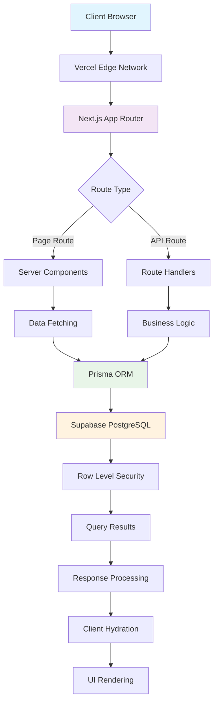
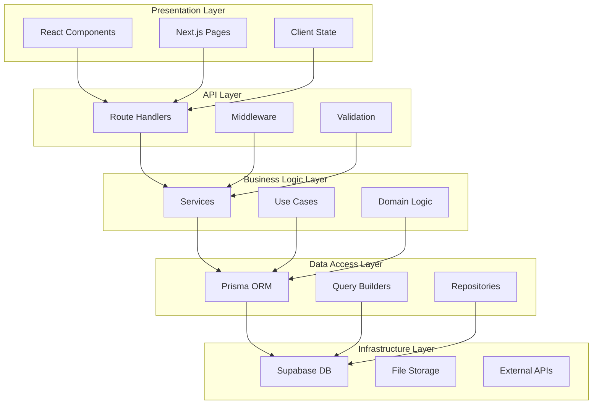
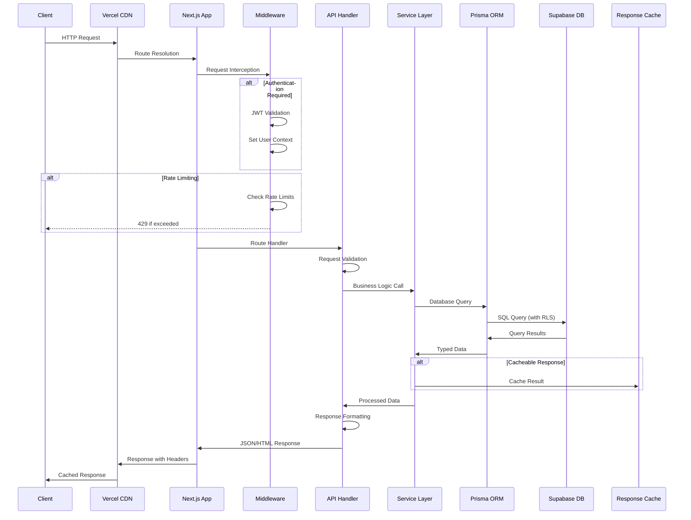
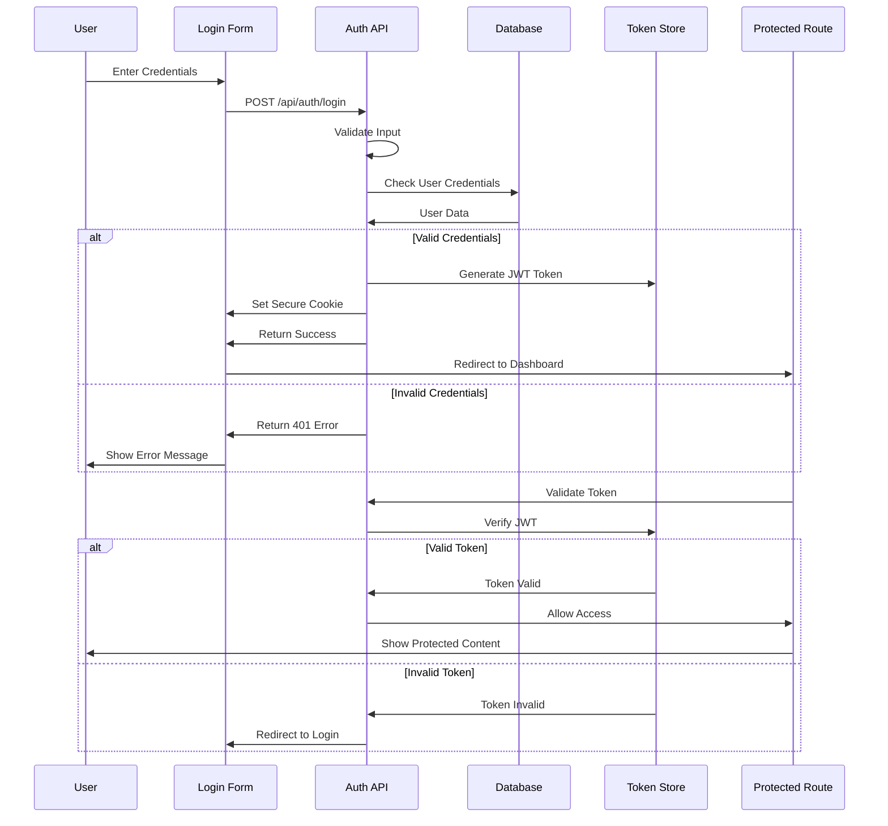
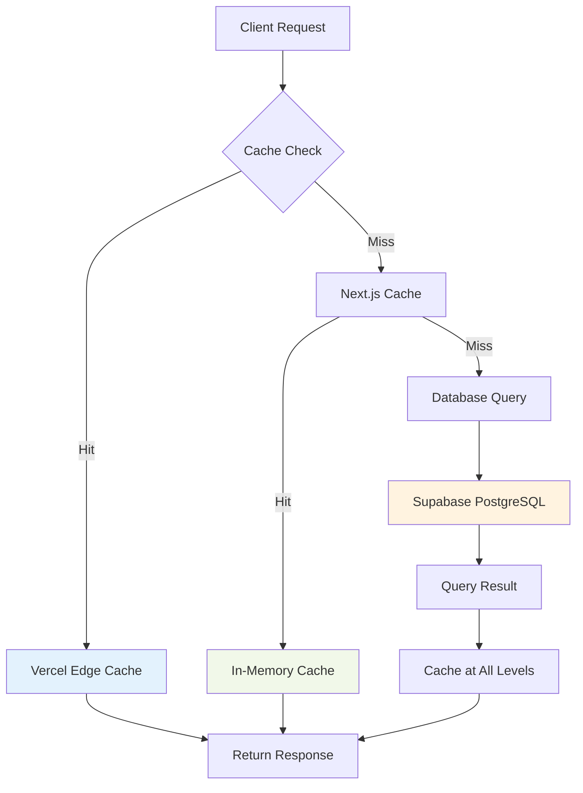
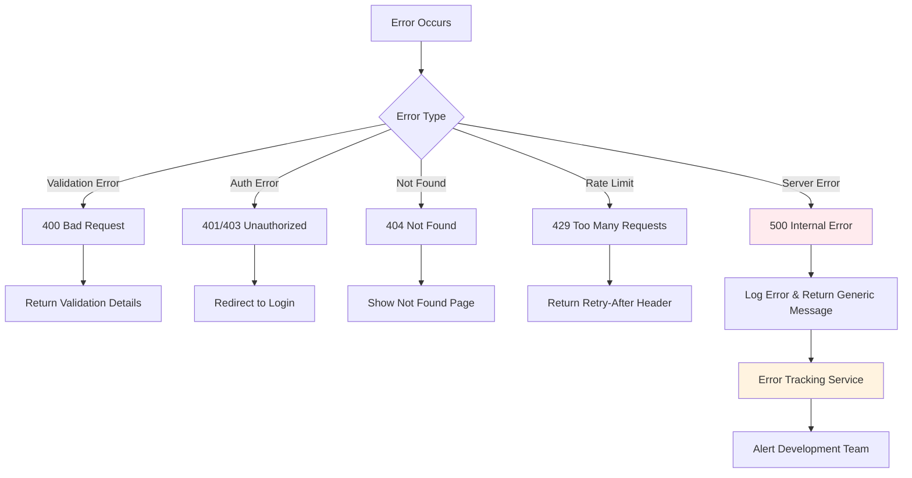

# 🔄 Veri Akışı ve API Patterns

Bu dokuman, **Dijital Kartvizit** projesinin veri akış mimarisini, API design patterns'lerini ve authentication flow'larını detaylandırır.

## 📋 İçindekiler

1. [Genel Veri Akış Mimarisi](#-genel-veri-akış-mimarisi)
2. [Request Lifecycle](#-request-lifecycle)
3. [Authentication & Authorization Flow](#-authentication--authorization-flow)
4. [API Design Patterns](#-api-design-patterns)
5. [Database Interaction Patterns](#-database-interaction-patterns)
6. [Caching Strategy](#-caching-strategy)
7. [Error Handling & Recovery](#-error-handling--recovery)
8. [Performance Optimizations](#-performance-optimizations)

---

## 🏗️ Genel Veri Akış Mimarisi

### System-Wide Data Flow



### Data Flow Layers



---

## 🔄 Request Lifecycle

### Complete Request Journey



### Request Processing Phases

**Phase 1: Request Reception**
```typescript
// Edge Network → Next.js App Router
// middleware.ts - Request interception
export async function middleware(request: NextRequest) {
  const pathname = request.nextUrl.pathname;
  const startTime = Date.now();
  
  // Add request ID for tracing
  const requestId = crypto.randomUUID();
  request.headers.set('x-request-id', requestId);
  
  // Continue to next phase
  const response = NextResponse.next();
  
  // Add performance headers
  response.headers.set('x-request-time', `${Date.now() - startTime}ms`);
  return response;
}
```

**Phase 2: Authentication & Authorization**
```typescript
// lib/auth/middleware.ts
export async function authenticateRequest(request: NextRequest) {
  const token = request.cookies.get('admin-token')?.value;
  
  if (!token) {
    return { authenticated: false, user: null };
  }
  
  try {
    const payload = await verifyJWT(token);
    const user = await getUserById(payload.userId);
    
    // Set user context for RLS
    await setUserContext(user.id, user.role);
    
    return { authenticated: true, user };
  } catch (error) {
    return { authenticated: false, user: null };
  }
}
```

**Phase 3: Business Logic Processing**
```typescript
// lib/services/FirmaService.ts
export class FirmaService {
  static async getCompanyBySlug(slug: string) {
    // Input validation
    const validatedSlug = slugSchema.parse(slug);
    
    // Check cache first
    const cached = await getCachedCompany(validatedSlug);
    if (cached) return cached;
    
    // Database query with optimized includes
    const company = await prisma.firmalar.findUnique({
      where: { slug: validatedSlug },
      include: {
        iletisim_bilgileri: { where: { aktif: true } },
        sosyal_medya_hesaplari: { where: { aktif: true } },
      },
    });
    
    if (!company) {
      throw new NotFoundError('Firma bulunamadı');
    }
    
    // Update view count asynchronously
    incrementViewCount(company.id).catch(console.error);
    
    // Cache result
    await cacheCompany(company);
    
    return company;
  }
}
```

---

## 🔐 Authentication & Authorization Flow

### JWT-based Authentication Flow



### Session Management Implementation

```typescript
// lib/auth/session.ts
interface SessionData {
  userId: number;
  username: string;
  role: 'admin' | 'user';
  issuedAt: number;
  expiresAt: number;
}

export class SessionManager {
  private static readonly SECRET_KEY = process.env.JWT_SECRET!;
  private static readonly EXPIRES_IN = 24 * 60 * 60 * 1000; // 24 hours
  
  static async createSession(user: User): Promise<string> {
    const payload: SessionData = {
      userId: user.id,
      username: user.username,
      role: user.role,
      issuedAt: Date.now(),
      expiresAt: Date.now() + this.EXPIRES_IN,
    };
    
    return jwt.sign(payload, this.SECRET_KEY, {
      algorithm: 'HS256',
      expiresIn: '24h',
    });
  }
  
  static async validateSession(token: string): Promise<SessionData | null> {
    try {
      const decoded = jwt.verify(token, this.SECRET_KEY) as SessionData;
      
      // Check if token is expired
      if (decoded.expiresAt < Date.now()) {
        return null;
      }
      
      return decoded;
    } catch (error) {
      return null;
    }
  }
  
  static async refreshSession(token: string): Promise<string | null> {
    const session = await this.validateSession(token);
    if (!session) return null;
    
    // Issue new token with extended expiry
    return this.createSession({
      id: session.userId,
      username: session.username,
      role: session.role,
    });
  }
}
```

### Row Level Security Integration

```typescript
// lib/auth/rls.ts - Supabase RLS Context
export async function setRLSContext(userId: number, role: string) {
  await prisma.$executeRaw`
    SELECT set_config('app.current_user_id', ${userId}::text, true)
  `;
  
  await prisma.$executeRaw`
    SELECT set_config('app.current_user_role', ${role}, true)
  `;
}

// Usage in API routes
export async function GET(request: NextRequest) {
  const session = await getSession(request);
  if (session) {
    await setRLSContext(session.userId, session.role);
  }
  
  // RLS policies now apply to all subsequent queries
  const companies = await prisma.firmalar.findMany();
  return NextResponse.json(companies);
}
```

---

## 🎯 API Design Patterns

### RESTful API Conventions

```typescript
// API Route Structure Pattern
// GET    /api/firmalar           - List companies
// POST   /api/firmalar           - Create company
// GET    /api/firmalar/[id]      - Get specific company
// PUT    /api/firmalar/[id]      - Update company
// DELETE /api/firmalar/[id]      - Delete company

// Custom endpoints for specific operations
// GET    /api/firmalar/by-slug/[slug]     - Get by slug
// POST   /api/firmalar/[id]/approve       - Approve company
// GET    /api/qr-codes/[slug]             - Generate QR code
// GET    /api/sayfalar/[slug]/vcard       - Generate vCard
```

### Response Format Standardization

```typescript
// lib/api/response.ts
interface ApiResponse<T = any> {
  success: boolean;
  data?: T;
  error?: string;
  details?: any;
  pagination?: PaginationInfo;
  meta?: ResponseMeta;
}

interface PaginationInfo {
  page: number;
  limit: number;
  total: number;
  totalPages: number;
  hasNext: boolean;
  hasPrev: boolean;
}

interface ResponseMeta {
  requestId: string;
  timestamp: string;
  version: string;
  processingTime: number;
}

export function createSuccessResponse<T>(
  data: T,
  pagination?: PaginationInfo,
  meta?: Partial<ResponseMeta>
): ApiResponse<T> {
  return {
    success: true,
    data,
    pagination,
    meta: {
      timestamp: new Date().toISOString(),
      version: '1.0.0',
      ...meta,
    },
  };
}

export function createErrorResponse(
  error: string,
  details?: any,
  status: number = 500
): ApiResponse {
  return {
    success: false,
    error,
    details,
    meta: {
      timestamp: new Date().toISOString(),
      version: '1.0.0',
    },
  };
}
```

### Input Validation Pattern

```typescript
// lib/validation/schemas.ts
import { z } from 'zod';

export const CompanyCreateSchema = z.object({
  firma_adi: z.string()
    .min(2, 'Firma adı en az 2 karakter olmalıdır')
    .max(100, 'Firma adı en fazla 100 karakter olabilir'),
  
  slug: z.string()
    .regex(/^[a-z0-9-]+$/, 'Slug sadece küçük harf, rakam ve tire içerebilir')
    .min(3, 'Slug en az 3 karakter olmalıdır'),
  
  yetkili_adi: z.string().optional(),
  yetkili_pozisyon: z.string().optional(),
  
  contacts: z.array(z.object({
    tip: z.enum(['telefon', 'email', 'adres', 'website']),
    deger: z.string().min(1),
    etiket: z.string().optional(),
  })).optional(),
  
  socialMedia: z.array(z.object({
    platform: z.string(),
    url: z.string().url(),
    etiket: z.string().optional(),
  })).optional(),
});

// Usage in API routes
export async function POST(request: NextRequest) {
  try {
    const body = await request.json();
    const validatedData = CompanyCreateSchema.parse(body);
    
    const company = await FirmaService.create(validatedData);
    return NextResponse.json(createSuccessResponse(company));
  } catch (error) {
    if (error instanceof z.ZodError) {
      return NextResponse.json(
        createErrorResponse('Validation failed', error.errors),
        { status: 400 }
      );
    }
    
    return NextResponse.json(
      createErrorResponse('Internal server error'),
      { status: 500 }
    );
  }
}
```

---

## 🗄️ Database Interaction Patterns

### Prisma Query Optimization

```typescript
// lib/db/queries.ts
export class OptimizedQueries {
  // Efficient pagination with cursor-based approach
  static async getPaginatedCompanies(cursor?: number, limit = 10) {
    return await prisma.firmalar.findMany({
      take: limit + 1, // Take one extra to check if there are more
      ...(cursor && {
        cursor: { id: cursor },
        skip: 1, // Skip the cursor
      }),
      where: { onay: true },
      select: {
        id: true,
        firma_adi: true,
        slug: true,
        profil_foto: true,
        goruntulenme: true,
        created_at: true,
        _count: {
          select: {
            iletisim_bilgileri: true,
            sosyal_medya_hesaplari: true,
          },
        },
      },
      orderBy: { created_at: 'desc' },
    });
  }
  
  // Optimized company details with selective includes
  static async getCompanyDetails(slug: string) {
    return await prisma.firmalar.findUnique({
      where: { slug },
      include: {
        iletisim_bilgileri: {
          where: { aktif: true },
          orderBy: { sira: 'asc' },
          select: {
            id: true,
            tip: true,
            deger: true,
            etiket: true,
          },
        },
        sosyal_medya_hesaplari: {
          where: { aktif: true },
          orderBy: { sira: 'asc' },
          select: {
            id: true,
            platform: true,
            url: true,
            etiket: true,
          },
        },
        banka_hesaplari: {
          where: { aktif: true },
          include: {
            hesaplar: {
              where: { aktif: true },
              select: {
                id: true,
                iban: true,
                para_birimi: true,
                hesap_turu: true,
              },
            },
          },
        },
      },
    });
  }
  
  // Batch operations for performance
  static async updateMultipleCompanies(
    companyIds: number[],
    updateData: Partial<Company>
  ) {
    return await prisma.firmalar.updateMany({
      where: { id: { in: companyIds } },
      data: {
        ...updateData,
        updated_at: new Date(),
      },
    });
  }
}
```

### Transaction Management

```typescript
// lib/db/transactions.ts
export class TransactionManager {
  static async createCompanyWithDetails(companyData: CompanyCreateData) {
    return await prisma.$transaction(async (tx) => {
      // Create main company record
      const company = await tx.firmalar.create({
        data: {
          firma_adi: companyData.firma_adi,
          slug: companyData.slug,
          yetkili_adi: companyData.yetkili_adi,
          yetkili_pozisyon: companyData.yetkili_pozisyon,
        },
      });
      
      // Create contact information
      if (companyData.contacts) {
        await tx.iletisimBilgisi.createMany({
          data: companyData.contacts.map((contact, index) => ({
            firma_id: company.id,
            tip: contact.tip,
            deger: contact.deger,
            etiket: contact.etiket,
            sira: index,
          })),
        });
      }
      
      // Create social media accounts
      if (companyData.socialMedia) {
        await tx.sosyalMedyaHesabi.createMany({
          data: companyData.socialMedia.map((social, index) => ({
            firma_id: company.id,
            platform: social.platform,
            url: social.url,
            etiket: social.etiket,
            sira: index,
          })),
        });
      }
      
      // Return complete company data
      return await tx.firmalar.findUnique({
        where: { id: company.id },
        include: {
          iletisim_bilgileri: true,
          sosyal_medya_hesaplari: true,
        },
      });
    });
  }
}
```

---

## ⚡ Caching Strategy

### Multi-Layer Caching Architecture



### Caching Implementation

```typescript
// lib/cache/manager.ts
interface CacheConfig {
  ttl: number; // Time to live in seconds
  staleWhileRevalidate?: number; // SWR duration
  tags?: string[]; // Cache invalidation tags
}

export class CacheManager {
  private static readonly DEFAULT_TTL = 300; // 5 minutes
  
  static async get<T>(key: string): Promise<T | null> {
    try {
      // Try memory cache first (fastest)
      const memoryResult = MemoryCache.get<T>(key);
      if (memoryResult) return memoryResult;
      
      // Try Redis cache (if available in production)
      if (process.env.REDIS_URL) {
        const redisResult = await RedisCache.get<T>(key);
        if (redisResult) {
          // Backfill memory cache
          MemoryCache.set(key, redisResult, 60); // 1 minute in memory
          return redisResult;
        }
      }
      
      return null;
    } catch (error) {
      console.error('Cache get error:', error);
      return null;
    }
  }
  
  static async set<T>(
    key: string,
    value: T,
    config: CacheConfig = { ttl: this.DEFAULT_TTL }
  ): Promise<void> {
    try {
      // Set in memory cache
      MemoryCache.set(key, value, Math.min(config.ttl, 300)); // Max 5 min in memory
      
      // Set in Redis cache if available
      if (process.env.REDIS_URL) {
        await RedisCache.set(key, value, config);
      }
      
      // Set cache tags for invalidation
      if (config.tags) {
        await this.setTags(key, config.tags);
      }
    } catch (error) {
      console.error('Cache set error:', error);
    }
  }
  
  static async invalidateByTag(tag: string): Promise<void> {
    try {
      const keys = await this.getKeysByTag(tag);
      await Promise.all([
        ...keys.map(key => MemoryCache.delete(key)),
        ...(process.env.REDIS_URL ? keys.map(key => RedisCache.delete(key)) : []),
      ]);
    } catch (error) {
      console.error('Cache invalidation error:', error);
    }
  }
}

// Cache-enabled service methods
export class CachedFirmaService {
  static async getCompanyBySlug(slug: string) {
    const cacheKey = `company:${slug}`;
    
    // Check cache first
    const cached = await CacheManager.get<Company>(cacheKey);
    if (cached) return cached;
    
    // Fetch from database
    const company = await OptimizedQueries.getCompanyDetails(slug);
    
    if (company) {
      // Cache for 10 minutes with tags for invalidation
      await CacheManager.set(cacheKey, company, {
        ttl: 600,
        tags: [`company:${company.id}`, 'companies'],
      });
    }
    
    return company;
  }
  
  static async updateCompany(id: number, updateData: Partial<Company>) {
    const company = await prisma.firmalar.update({
      where: { id },
      data: updateData,
    });
    
    // Invalidate related caches
    await CacheManager.invalidateByTag(`company:${id}`);
    
    return company;
  }
}
```

### Next.js Caching Configuration

```typescript
// app/[slug]/page.tsx - Static Generation with Revalidation
export async function generateStaticParams() {
  const companies = await prisma.firmalar.findMany({
    where: { onay: true },
    select: { slug: true },
    take: 100, // Pre-generate top 100 companies
  });
  
  return companies.map((company) => ({
    slug: company.slug,
  }));
}

export const revalidate = 300; // Revalidate every 5 minutes

export default async function CompanyPage({ params }: { params: { slug: string } }) {
  const company = await CachedFirmaService.getCompanyBySlug(params.slug);
  
  if (!company) {
    notFound();
  }
  
  return <CompanyProfile company={company} />;
}
```

---

## ❌ Error Handling & Recovery

### Comprehensive Error Handling Strategy



### Error Class Hierarchy

```typescript
// lib/errors/index.ts
export abstract class BaseError extends Error {
  abstract readonly statusCode: number;
  abstract readonly errorCode: string;
  readonly details?: any;
  readonly timestamp: Date;
  
  constructor(message: string, details?: any) {
    super(message);
    this.details = details;
    this.timestamp = new Date();
    this.name = this.constructor.name;
  }
  
  toJSON() {
    return {
      name: this.name,
      message: this.message,
      statusCode: this.statusCode,
      errorCode: this.errorCode,
      details: this.details,
      timestamp: this.timestamp.toISOString(),
    };
  }
}

export class ValidationError extends BaseError {
  readonly statusCode = 400;
  readonly errorCode = 'VALIDATION_ERROR';
}

export class NotFoundError extends BaseError {
  readonly statusCode = 404;
  readonly errorCode = 'NOT_FOUND';
}

export class UnauthorizedError extends BaseError {
  readonly statusCode = 401;
  readonly errorCode = 'UNAUTHORIZED';
}

export class RateLimitError extends BaseError {
  readonly statusCode = 429;
  readonly errorCode = 'RATE_LIMIT_EXCEEDED';
  
  constructor(message: string, retryAfter: number) {
    super(message, { retryAfter });
  }
}

export class DatabaseError extends BaseError {
  readonly statusCode = 500;
  readonly errorCode = 'DATABASE_ERROR';
}
```

### Error Handler Middleware

```typescript
// lib/middleware/errorHandler.ts
export function withErrorHandling(handler: NextApiHandler): NextApiHandler {
  return async (req: NextApiRequest, res: NextApiResponse) => {
    try {
      await handler(req, res);
    } catch (error) {
      await handleError(error, req, res);
    }
  };
}

async function handleError(
  error: unknown,
  req: NextApiRequest,
  res: NextApiResponse
) {
  // Log error with context
  const errorContext = {
    url: req.url,
    method: req.method,
    headers: req.headers,
    query: req.query,
    body: req.body,
    timestamp: new Date().toISOString(),
  };
  
  if (error instanceof BaseError) {
    // Known error types
    console.error(`${error.errorCode}:`, error.message, { error: error.toJSON(), context: errorContext });
    
    return res.status(error.statusCode).json({
      success: false,
      error: error.message,
      code: error.errorCode,
      ...(process.env.NODE_ENV === 'development' && { details: error.details }),
    });
  }
  
  // Unknown errors - log full details but don't expose them
  console.error('Unexpected error:', error, { context: errorContext });
  
  // Send to error tracking service
  if (process.env.SENTRY_DSN) {
    Sentry.captureException(error, { extra: errorContext });
  }
  
  return res.status(500).json({
    success: false,
    error: 'Internal server error',
    code: 'INTERNAL_ERROR',
  });
}
```

### Circuit Breaker Pattern

```typescript
// lib/resilience/circuitBreaker.ts
interface CircuitBreakerOptions {
  failureThreshold: number;
  resetTimeout: number;
  monitoringWindow: number;
}

export class CircuitBreaker {
  private failureCount = 0;
  private lastFailureTime = 0;
  private state: 'CLOSED' | 'OPEN' | 'HALF_OPEN' = 'CLOSED';
  
  constructor(private options: CircuitBreakerOptions) {}
  
  async execute<T>(operation: () => Promise<T>): Promise<T> {
    if (this.state === 'OPEN') {
      if (Date.now() - this.lastFailureTime > this.options.resetTimeout) {
        this.state = 'HALF_OPEN';
      } else {
        throw new Error('Circuit breaker is OPEN');
      }
    }
    
    try {
      const result = await operation();
      this.onSuccess();
      return result;
    } catch (error) {
      this.onFailure();
      throw error;
    }
  }
  
  private onSuccess() {
    this.failureCount = 0;
    this.state = 'CLOSED';
  }
  
  private onFailure() {
    this.failureCount++;
    this.lastFailureTime = Date.now();
    
    if (this.failureCount >= this.options.failureThreshold) {
      this.state = 'OPEN';
    }
  }
}

// Usage in database operations
const dbCircuitBreaker = new CircuitBreaker({
  failureThreshold: 5,
  resetTimeout: 60000, // 1 minute
  monitoringWindow: 300000, // 5 minutes
});

export async function resilientDatabaseOperation<T>(operation: () => Promise<T>): Promise<T> {
  return await dbCircuitBreaker.execute(operation);
}
```

---

## 🚀 Performance Optimizations

### Query Performance Optimization

```sql
-- Database performance indexes
CREATE INDEX CONCURRENTLY idx_firmalar_slug_onay ON firmalar(slug, onay) WHERE onay = true;
CREATE INDEX CONCURRENTLY idx_firmalar_search ON firmalar USING GIN(to_tsvector('turkish', firma_adi || ' ' || COALESCE(firma_hakkinda, '')));
CREATE INDEX CONCURRENTLY idx_iletisim_firma_tip_aktif ON IletisimBilgisi(firma_id, tip) WHERE aktif = true;

-- Query performance monitoring
EXPLAIN (ANALYZE, BUFFERS) 
SELECT f.*, 
       COUNT(i.id) as contact_count,
       COUNT(s.id) as social_count
FROM firmalar f
LEFT JOIN IletisimBilgisi i ON f.id = i.firma_id AND i.aktif = true
LEFT JOIN SosyalMedyaHesabi s ON f.id = s.firma_id AND s.aktif = true
WHERE f.onay = true
GROUP BY f.id
ORDER BY f.goruntulenme DESC
LIMIT 10;
```

### Application Performance Monitoring

```typescript
// lib/monitoring/performance.ts
export class PerformanceMonitor {
  static async measureOperation<T>(
    operation: () => Promise<T>,
    operationName: string
  ): Promise<T> {
    const startTime = performance.now();
    const startMemory = process.memoryUsage();
    
    try {
      const result = await operation();
      const endTime = performance.now();
      const endMemory = process.memoryUsage();
      
      const metrics = {
        operation: operationName,
        duration: endTime - startTime,
        memoryDelta: endMemory.heapUsed - startMemory.heapUsed,
        timestamp: new Date().toISOString(),
      };
      
      // Log performance metrics
      console.log('Performance:', metrics);
      
      // Send to monitoring service
      if (process.env.NODE_ENV === 'production') {
        await sendMetrics(metrics);
      }
      
      return result;
    } catch (error) {
      const endTime = performance.now();
      
      const errorMetrics = {
        operation: operationName,
        duration: endTime - startTime,
        error: error instanceof Error ? error.message : 'Unknown error',
        timestamp: new Date().toISOString(),
      };
      
      console.error('Performance Error:', errorMetrics);
      throw error;
    }
  }
}

// Usage in services
export class MonitoredFirmaService {
  static async getCompanyBySlug(slug: string) {
    return await PerformanceMonitor.measureOperation(
      () => CachedFirmaService.getCompanyBySlug(slug),
      'getCompanyBySlug'
    );
  }
}
```

---

## 📊 Data Flow Metrics & Monitoring

### Key Performance Indicators

```yaml
API Performance Metrics:
  Response Time: < 200ms (95th percentile)
  Throughput: > 100 requests/second
  Error Rate: < 1%
  Availability: > 99.9%

Database Metrics:
  Query Response Time: < 50ms (average)
  Connection Pool Utilization: < 80%
  Slow Query Threshold: > 500ms
  Transaction Rollback Rate: < 0.1%

Cache Metrics:
  Hit Rate: > 85%
  Miss Penalty: < 100ms
  Eviction Rate: < 5%
  Memory Utilization: < 80%

User Experience:
  Time to First Byte (TTFB): < 100ms
  First Contentful Paint (FCP): < 1.2s
  Largest Contentful Paint (LCP): < 2.5s
  Cumulative Layout Shift (CLS): < 0.1
```

### Monitoring Dashboard

```typescript
// lib/monitoring/dashboard.ts
export interface SystemMetrics {
  api: {
    requestsPerSecond: number;
    averageResponseTime: number;
    errorRate: number;
    activeConnections: number;
  };
  database: {
    activeConnections: number;
    queryResponseTime: number;
    slowQueries: number;
    cacheHitRate: number;
  };
  system: {
    memoryUsage: number;
    cpuUsage: number;
    diskUsage: number;
    networkThroughput: number;
  };
}

export class MetricsCollector {
  static async collect(): Promise<SystemMetrics> {
    return {
      api: await this.collectApiMetrics(),
      database: await this.collectDatabaseMetrics(),
      system: await this.collectSystemMetrics(),
    };
  }
  
  private static async collectApiMetrics() {
    // Collect API metrics from request logs
    return {
      requestsPerSecond: await this.calculateRPS(),
      averageResponseTime: await this.calculateAvgResponseTime(),
      errorRate: await this.calculateErrorRate(),
      activeConnections: await this.getActiveConnections(),
    };
  }
}
```

---

## ✅ Data Flow Implementation Checklist

**Architecture:**
- [x] Multi-layer architecture implemented
- [x] Clear separation of concerns
- [x] Proper abstraction levels
- [x] Error boundaries established

**API Design:**
- [x] RESTful conventions followed
- [x] Consistent response formats
- [x] Input validation implemented
- [x] Authentication integrated

**Database:**
- [x] Optimized queries with indexes
- [x] Transaction management
- [x] Connection pooling
- [x] RLS policies active

**Caching:**
- [x] Multi-layer caching strategy
- [x] Cache invalidation patterns
- [x] Performance monitoring
- [x] SWR implementation

**Error Handling:**
- [x] Comprehensive error types
- [x] Graceful degradation
- [x] Monitoring and alerting
- [x] Recovery mechanisms

---

**🔄 Data Flow Architecture Tamamlandı!**

Bu kapsamlı dokuman, projenin veri akış mimarisini, API patterns'lerini ve performance optimization stratejilerini detaylandırmaktadır. Tüm data flow kararları scalability, reliability ve maintainability kriterleri doğrultusunda tasarlanmıştır.

---
*Son güncelleme: 2025-08-25 | Versiyon: 1.0.0*