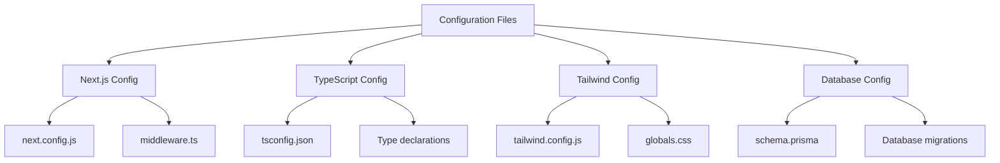
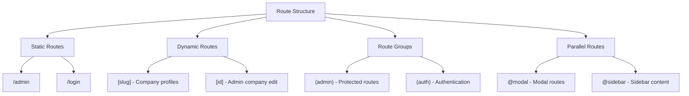
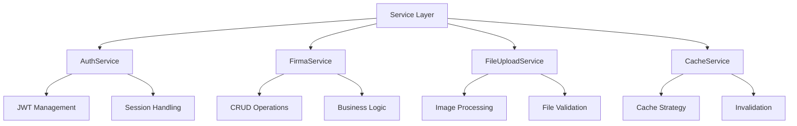
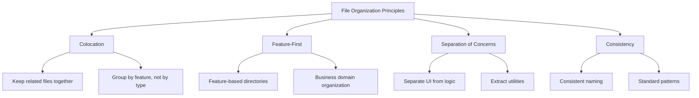
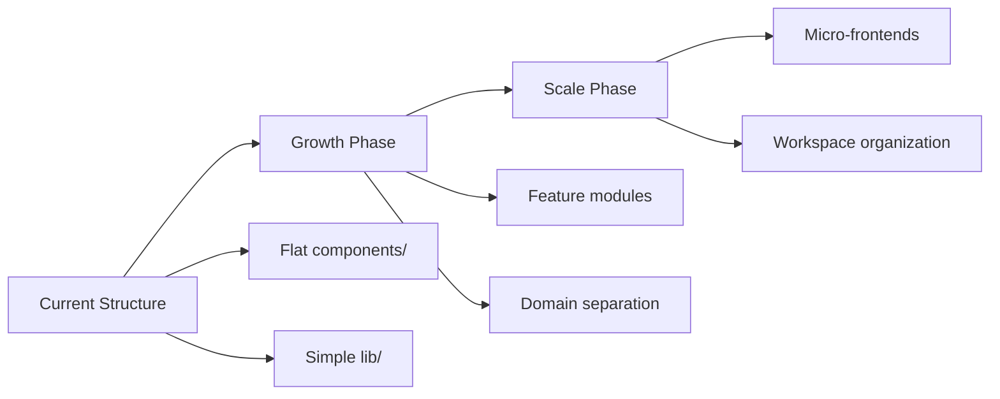

# 📁 Folder Structure ve Organizasyon

Bu dokuman, **Dijital Kartvizit** projesinin Next.js 14 App Router tabanlı klasör yapısını, organizasyon prensiplerini ve naming conventions'ları detaylandırır.

## 📋 İçindekiler

1. [Project Root Structure](#-project-root-structure)
2. [App Directory Organization](#-app-directory-organization)
3. [Component Architecture](#-component-architecture)
4. [Library Organization](#-library-organization)
5. [API Routes Structure](#-api-routes-structure)
6. [File Naming Conventions](#-file-naming-conventions)
7. [Import/Export Patterns](#-importexport-patterns)
8. [Development Guidelines](#-development-guidelines)

---

## 🗂️ Project Root Structure

### High-Level Directory Overview

```
dijital-kartvizit/
├── 📁 app/                    # Next.js 14 App Router
│   ├── 📁 [slug]/            # Dynamic company pages
│   ├── 📁 admin/             # Admin dashboard
│   ├── 📁 api/               # API routes
│   ├── 📁 components/        # Shared React components
│   ├── 📁 lib/               # Utilities & business logic
│   └── 📁 login/             # Authentication pages
├── 📁 docs/                  # Project documentation
├── 📁 public/                # Static assets
├── 📁 prisma/                # Database schema & migrations
├── 📁 scripts/               # Build & deployment scripts
├── 📁 supabase/              # Supabase configuration
├── 📄 next.config.js         # Next.js configuration
├── 📄 schema.prisma          # Database schema
├── 📄 tailwind.config.js     # Tailwind CSS config
└── 📄 tsconfig.json          # TypeScript config
```

### Configuration Files Organization



---

## 📱 App Directory Organization

### Next.js 14 App Router Structure

```
app/
├── 📄 layout.tsx             # Root layout (shared across all pages)
├── 📄 page.tsx               # Homepage route (/)
├── 📄 globals.css            # Global styles
├── 📄 not-found.tsx          # 404 error page
├── 📄 favicon.ico            # Site favicon
├── 📄 providers.tsx          # Context providers wrapper
│
├── 📁 [slug]/                # Dynamic company profiles
│   ├── 📄 page.tsx           # Company profile page
│   ├── 📁 qr/                # QR code routes
│   │   └── 📄 page.tsx       # QR code display
│   └── 📁 vcard/             # vCard download
│       └── 📄 page.tsx       # vCard generation
│
├── 📁 admin/                 # Admin dashboard section
│   ├── 📄 layout.tsx         # Admin-specific layout
│   ├── 📄 page.tsx           # Admin dashboard home
│   ├── 📁 dashboard/         # Main dashboard
│   ├── 📁 firmalar/          # Company management
│   │   ├── 📄 page.tsx       # Companies list
│   │   ├── 📁 [id]/          # Individual company
│   │   │   └── 📄 page.tsx   # Company details/edit
│   │   └── 📁 yeni/          # Create new company
│   │       └── 📄 page.tsx   # Company creation form
│   ├── 📁 ayarlar/           # Settings
│   │   └── 📄 page.tsx       # Admin settings
│   └── 📁 temalar/           # Template management
│       └── 📄 page.tsx       # Template selector
│
├── 📁 login/                 # Authentication
│   ├── 📄 page.tsx           # Login page
│   └── 📄 login-form.tsx     # Login form component
│
├── 📁 api/                   # API endpoints (detailed below)
├── 📁 components/            # Shared components (detailed below)
└── 📁 lib/                   # Utility libraries (detailed below)
```

### Route Organization Patterns



---

## 🧩 Component Architecture

### Component Directory Structure

```
components/
├── 📁 ui/                    # Primitive UI components
│   ├── 📄 OptimizedImage.tsx # Image optimization wrapper
│   ├── 📄 ProgressBar.tsx    # Progress indicator
│   └── 📄 Skeleton.tsx       # Loading skeletons
│
├── 📁 layout/                # Layout-specific components
│   ├── 📄 Header.tsx         # Site header
│   ├── 📄 Footer.tsx         # Site footer
│   └── 📄 Navbar.tsx         # Navigation component
│
├── 📁 forms/                 # Form components
│   ├── 📄 CompanyForm.tsx    # Company creation/edit
│   ├── 📄 ContactForm.tsx    # Contact information
│   └── 📄 LoginForm.tsx      # Authentication form
│
├── 📁 business/              # Business logic components
│   ├── 📄 CompanyProfile.tsx # Company display
│   ├── 📄 QRGenerator.tsx    # QR code generation
│   └── 📄 VCardExporter.tsx  # vCard export functionality
│
└── 📁 features/              # Feature-specific components
    ├── 📄 HeroSection.tsx    # Landing page hero
    ├── 📄 PricingSection.tsx # Pricing display
    └── 📄 TrustIndicators.tsx # Trust signals
```

### Component Naming & Organization

```typescript
// Example: Component file structure
// components/business/CompanyProfile.tsx

import React from 'react';
import { Company } from '@/lib/types';
import { OptimizedImage } from '@/components/ui/OptimizedImage';
import { ContactInfo } from './ContactInfo';
import { SocialMedia } from './SocialMedia';

interface CompanyProfileProps {
  company: Company;
  isPreview?: boolean;
}

export function CompanyProfile({ company, isPreview = false }: CompanyProfileProps) {
  return (
    <div className="company-profile">
      <header className="company-header">
        <OptimizedImage 
          src={company.profilePhoto}
          alt={`${company.name} profil fotoğrafı`}
          width={200}
          height={200}
        />
        <h1>{company.name}</h1>
      </header>
      
      <ContactInfo contacts={company.contacts} />
      <SocialMedia accounts={company.socialMedia} />
    </div>
  );
}

// Named export for easier imports
export default CompanyProfile;
```

---

## 📚 Library Organization

### Lib Directory Structure

```
lib/
├── 📁 auth/                  # Authentication utilities
│   ├── 📄 auth.ts            # Auth configuration
│   └── 📄 middleware.ts      # Auth middleware
│
├── 📁 db/                    # Database utilities
│   ├── 📄 db.ts              # Prisma client
│   ├── 📄 direct-db.ts       # Direct DB connections
│   └── 📄 cache.ts           # Database caching
│
├── 📁 services/              # Business services
│   ├── 📄 AuthService.ts     # Authentication service
│   ├── 📄 FirmaService.ts    # Company management
│   ├── 📄 FileUploadService.ts # File handling
│   └── 📄 ServiceRegistry.ts # Service locator
│
├── 📁 templates/             # Template system
│   ├── 📄 templateRegistry.ts # Template manager
│   ├── 📄 template-base.ts   # Base template class
│   └── 📄 template1-gold.ts  # Specific templates
│
├── 📁 utils/                 # Utility functions
│   ├── 📄 utils.ts           # General utilities
│   ├── 📄 validation.ts      # Form validation
│   └── 📄 getBaseUrl.ts      # URL utilities
│
├── 📁 hooks/                 # React custom hooks
│   ├── 📄 useFirmalar.ts     # Company data hooks
│   └── 📄 fetcher.ts         # Data fetching utilities
│
├── 📁 types/                 # TypeScript definitions
│   └── 📄 types.ts           # Type definitions
│
└── 📁 config/                # Configuration files
    ├── 📄 constants.ts       # App constants
    └── 📄 environment.ts     # Environment variables
```

### Service Layer Architecture



---

## 🌐 API Routes Structure

### API Directory Organization

```
api/
├── 📁 auth/                  # Authentication endpoints
│   └── 📁 [...nextauth]/     # NextAuth.js configuration
│       └── 📄 route.ts       # Auth route handler
│
├── 📁 firmalar/              # Company management API
│   ├── 📄 route.ts           # GET /api/firmalar (list)
│   │                         # POST /api/firmalar (create)
│   ├── 📁 [id]/              # Individual company operations
│   │   └── 📄 route.ts       # GET/PUT/DELETE /api/firmalar/[id]
│   ├── 📁 by-slug/           # Slug-based lookup
│   │   └── 📁 [slug]/
│   │       └── 📄 route.ts   # GET /api/firmalar/by-slug/[slug]
│   └── 📁 slug/              # Slug operations
│       └── 📁 [slug]/
│           └── 📄 route.ts   # Slug-specific operations
│
├── 📁 qr-codes/              # QR code generation
│   └── 📁 [slug]/
│       └── 📄 route.ts       # GET /api/qr-codes/[slug]
│
├── 📁 sayfalar/              # Page-related APIs
│   └── 📁 [slug]/
│       ├── 📄 route.ts       # Page data API
│       └── 📁 vcard/         # vCard generation
│           └── 📄 route.ts   # GET /api/sayfalar/[slug]/vcard
│
├── 📁 settings/              # Application settings
│   └── 📁 icon-order/
│       └── 📄 route.ts       # Icon ordering API
│
├── 📁 upload/                # File upload endpoints
│   └── 📄 route.ts           # POST /api/upload
│
├── 📄 health.ts              # Health check endpoint
└── 📄 monitoring.ts          # Monitoring endpoint
```

### API Route Handler Pattern

```typescript
// api/firmalar/route.ts - RESTful API Pattern
import { NextRequest, NextResponse } from 'next/server';
import { FirmaService } from '@/lib/services/FirmaService';
import { validateAuth } from '@/lib/auth';

// GET /api/firmalar - List companies
export async function GET(request: NextRequest) {
  try {
    const searchParams = request.nextUrl.searchParams;
    const page = parseInt(searchParams.get('page') ?? '1');
    const limit = parseInt(searchParams.get('limit') ?? '10');
    
    const companies = await FirmaService.getAll({
      page,
      limit,
      filters: {
        approved: searchParams.get('approved') === 'true',
        sector: searchParams.get('sector') || undefined,
      }
    });
    
    return NextResponse.json({
      success: true,
      data: companies.items,
      pagination: companies.pagination,
    });
  } catch (error) {
    return NextResponse.json(
      { success: false, error: 'Failed to fetch companies' },
      { status: 500 }
    );
  }
}

// POST /api/firmalar - Create company
export async function POST(request: NextRequest) {
  try {
    const authResult = await validateAuth(request);
    if (!authResult.success) {
      return NextResponse.json(
        { success: false, error: 'Unauthorized' },
        { status: 401 }
      );
    }
    
    const body = await request.json();
    const company = await FirmaService.create(body);
    
    return NextResponse.json({
      success: true,
      data: company,
    }, { status: 201 });
  } catch (error) {
    return NextResponse.json(
      { success: false, error: 'Failed to create company' },
      { status: 500 }
    );
  }
}
```

---

## 📝 File Naming Conventions

### Naming Standards

```yaml
Files & Directories:
  Components: PascalCase (CompanyProfile.tsx)
  Pages: lowercase (page.tsx, layout.tsx)
  API Routes: lowercase (route.ts)
  Utilities: camelCase (authUtils.ts)
  Types: PascalCase (Company.types.ts)
  Hooks: camelCase with 'use' prefix (useFirmalar.ts)
  Services: PascalCase with 'Service' suffix (FirmaService.ts)
  Constants: UPPER_SNAKE_CASE (API_ENDPOINTS.ts)

Directories:
  Feature-based: lowercase-with-dashes (social-media/)
  Component groups: lowercase (components/, lib/)
  API routes: lowercase (api/firmalar/)
  Dynamic routes: [brackets] ([slug]/, [id]/)
```

### Import Path Conventions

```typescript
// Import order and aliasing
import React from 'react';                    // External libraries
import { NextRequest } from 'next/server';    // Next.js imports

import { Company } from '@/lib/types';        // Internal types
import { FirmaService } from '@/lib/services/FirmaService';  // Services
import { validateAuth } from '@/lib/auth';    // Utilities

import { CompanyForm } from '@/components/forms/CompanyForm';  // Components
import { OptimizedImage } from '@/components/ui/OptimizedImage';

import './styles.css';                        // Local styles (last)
```

---

## 🔄 Import/Export Patterns

### Barrel Exports Pattern

```typescript
// lib/services/index.ts - Barrel export
export { AuthService } from './AuthService';
export { FirmaService } from './FirmaService';
export { FileUploadService } from './FileUploadService';
export { CacheInvalidationService } from './CacheInvalidationService';

// Usage:
import { FirmaService, AuthService } from '@/lib/services';
```

### Component Export Patterns

```typescript
// Default export for main component
export default function CompanyProfile({ company }: CompanyProfileProps) {
  // Component implementation
}

// Named exports for utilities and types
export type { CompanyProfileProps };
export { validateCompanyData } from './utils';

// Re-exports for related components
export { ContactInfo } from './ContactInfo';
export { SocialMediaLinks } from './SocialMediaLinks';
```

### Dynamic Imports for Code Splitting

```typescript
// Dynamic import for heavy components
import dynamic from 'next/dynamic';

const QRGenerator = dynamic(() => import('@/components/QRGenerator'), {
  loading: () => <QRGeneratorSkeleton />,
  ssr: false, // Client-side only
});

// Conditional dynamic imports
const AdminPanel = dynamic(
  () => import('@/components/AdminPanel').then(mod => mod.AdminPanel),
  { ssr: false }
);
```

---

## 📊 Development Guidelines

### File Organization Best Practices



### Code Organization Principles

**1. Feature-First Organization:**
```
features/
├── 📁 company-management/
│   ├── 📁 components/
│   ├── 📁 hooks/
│   ├── 📁 services/
│   └── 📁 types/
└── 📁 authentication/
    ├── 📁 components/
    ├── 📁 hooks/
    └── 📁 utils/
```

**2. Layered Architecture:**
```
└── 📁 src/
    ├── 📁 presentation/    # UI components, pages
    ├── 📁 business/        # Services, use cases
    ├── 📁 data/            # Database, external APIs
    └── 📁 shared/          # Common utilities, types
```

**3. Domain-Driven Design:**
```
└── 📁 domains/
    ├── 📁 company/         # Company domain
    ├── 📁 user/            # User domain
    └── 📁 shared/          # Shared kernel
```

### Path Mapping Configuration

```json
// tsconfig.json - Path aliases
{
  "compilerOptions": {
    "baseUrl": ".",
    "paths": {
      "@/*": ["./app/*"],
      "@/components/*": ["./app/components/*"],
      "@/lib/*": ["./app/lib/*"],
      "@/services/*": ["./app/lib/services/*"],
      "@/types/*": ["./app/lib/types/*"],
      "@/hooks/*": ["./app/lib/hooks/*"],
      "@/utils/*": ["./app/lib/utils/*"],
      "@/api/*": ["./app/api/*"]
    }
  }
}
```

---

## 📈 Scalability Considerations

### Folder Structure Evolution



### Future Structure Considerations

```
# Phase 2: Feature Modules (10+ developers)
app/
├── 📁 modules/
│   ├── 📁 company-management/
│   ├── 📁 user-authentication/
│   └── 📁 analytics-reporting/
└── 📁 shared/

# Phase 3: Workspace (20+ developers)  
packages/
├── 📁 core-ui/              # Shared UI components
├── 📁 business-logic/       # Shared business logic
├── 📁 admin-app/           # Admin application
└── 📁 public-app/          # Public application
```

---

## 🧪 Testing Structure

### Test File Organization

```
__tests__/
├── 📁 components/
│   ├── 📄 CompanyProfile.test.tsx
│   └── 📄 ContactForm.test.tsx
├── 📁 lib/
│   ├── 📄 utils.test.ts
│   └── 📄 validation.test.ts
├── 📁 api/
│   └── 📄 firmalar.test.ts
└── 📁 e2e/
    ├── 📄 company-creation.spec.ts
    └── 📄 admin-dashboard.spec.ts
```

### Test Naming Conventions

```typescript
// Component tests: Component.test.tsx
describe('CompanyProfile', () => {
  it('should render company information correctly', () => {
    // Test implementation
  });
  
  it('should handle missing profile photo gracefully', () => {
    // Test implementation
  });
});

// Service tests: Service.test.ts
describe('FirmaService', () => {
  describe('getAll', () => {
    it('should return paginated results', async () => {
      // Test implementation
    });
  });
});
```

---

## 📋 Folder Structure Checklist

**Project Organization:**
- [x] Clear separation between app, docs, and config
- [x] Logical grouping of related files
- [x] Consistent naming conventions applied
- [x] Path aliases configured correctly

**App Router Structure:**
- [x] Proper page.tsx and layout.tsx placement
- [x] Dynamic routes correctly structured
- [x] API routes follow RESTful conventions
- [x] Component hierarchy makes sense

**Code Organization:**
- [x] Components grouped by purpose
- [x] Services layer properly abstracted
- [x] Utilities organized and reusable
- [x] Types and interfaces well-defined

**Scalability:**
- [x] Structure supports growth
- [x] Feature-first organization where appropriate
- [x] Clear separation of concerns
- [x] Easy to navigate and understand

---

## 🚀 Sonraki Adımlar

Folder structure analizi tamamlandıktan sonra:

1. **[data-flow.md](./data-flow.md)** - Veri akışı ve API patterns
2. **[../04-development/](../04-development/)** - Development workflow
3. **[../05-testing/](../05-testing/)** - Testing strategies
4. **[../06-deployment/](../06-deployment/)** - Deployment processes

---

**📁 Folder Structure Dokümantasyonu Tamamlandı!**

Bu dokuman, projenin file organization, naming conventions ve scalability strategy'sini kapsamlı olarak açıklamaktadır. Tüm organizasyon kararları maintainability, developer experience ve team collaboration kriterleri doğrultusunda alınmıştır.

---
*Son güncelleme: 2025-08-25 | Versiyon: 1.0.0*