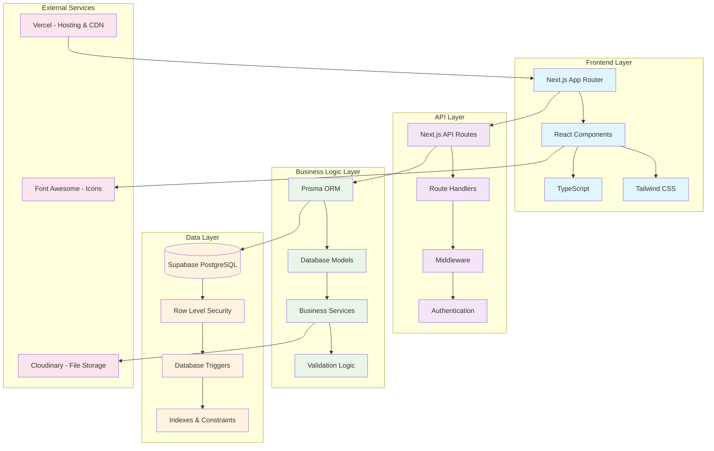
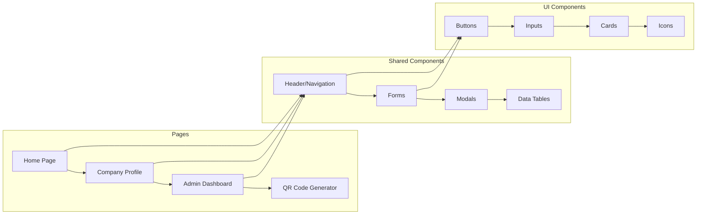
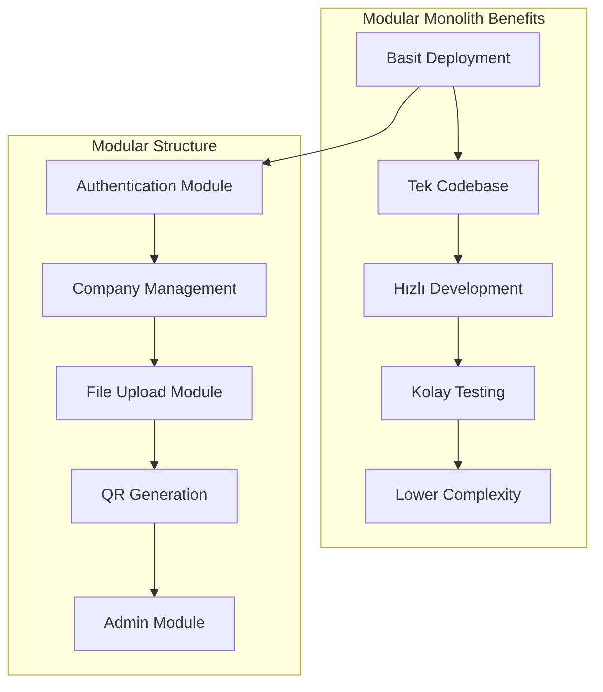
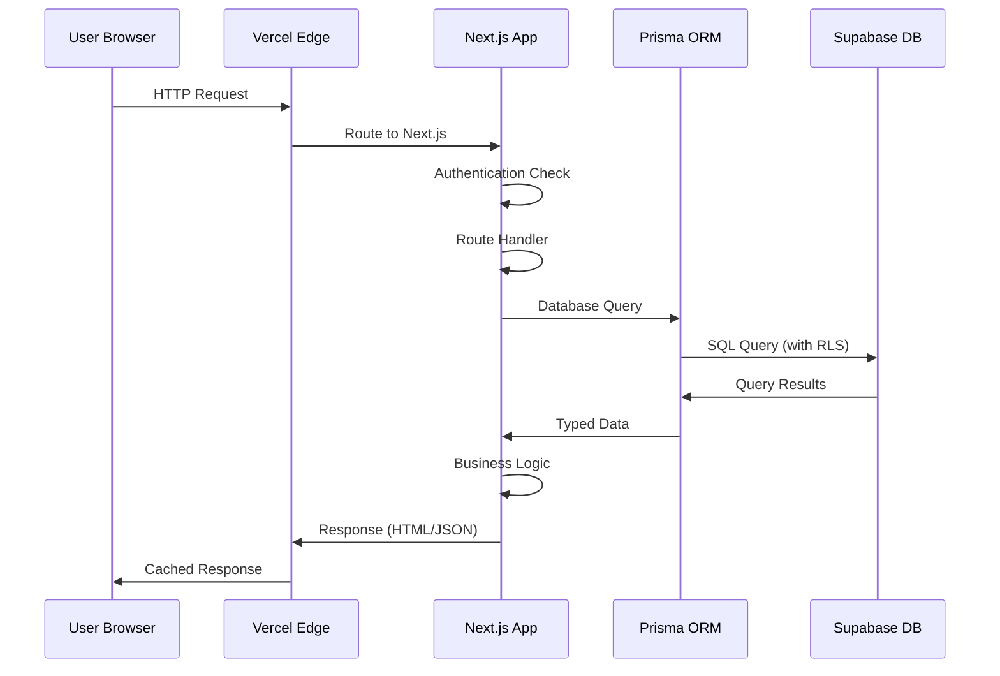
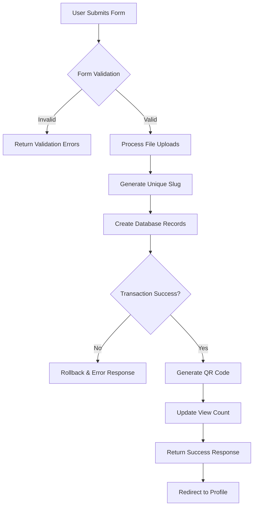
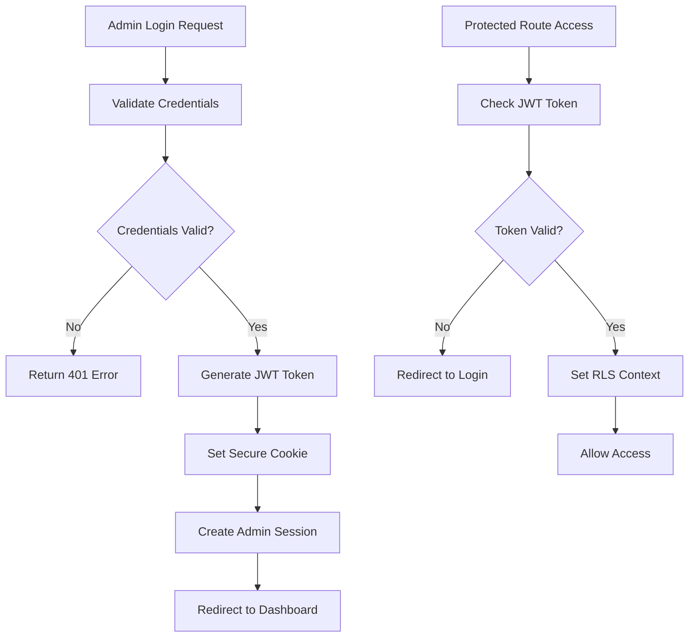
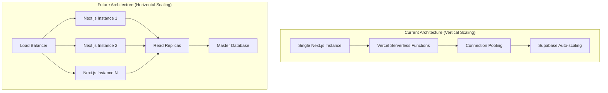
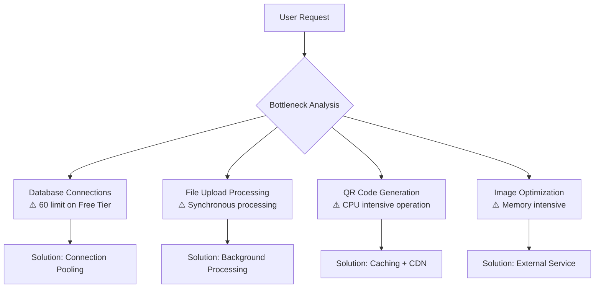
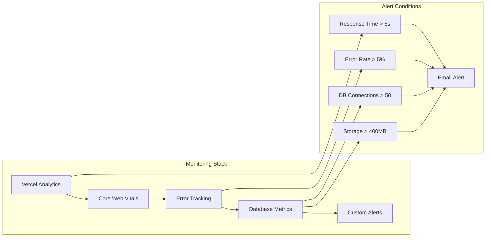
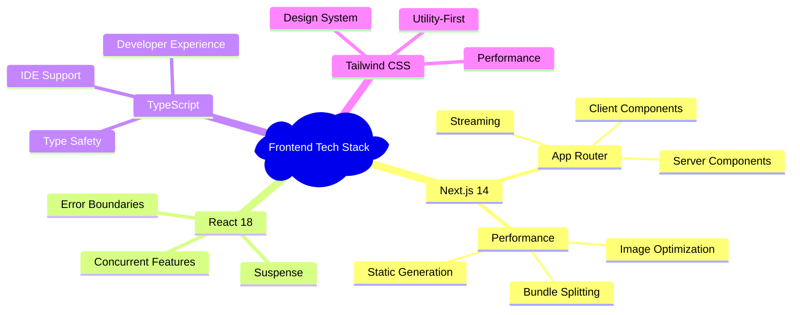

# 🏗️ Sistem Mimarisi Genel Bakış

Bu dokuman, **Dijital Kartvizit** projesinin high-level sistem mimarisini, tasarım kararlarını ve scalability stratejisini detaylandırır.

## 📋 İçindekiler

1. [Sistem Genel Mimarisi](#-sistem-genel-mimarisi)
2. [Mimari Yaklaşım: Modular Monolith](#-mimari-yaklaşım-modular-monolith)
3. [Veri Akışı Diyagramları](#-veri-akışı-diyagramları)
4. [Scalability Stratejisi](#-scalability-stratejisi)
5. [Bottleneck Analizi](#-bottleneck-analizi)
6. [Technology Stack Rationale](#-technology-stack-rationale)
7. [Architecture Decision Records (ADRs)](#-architecture-decision-records-adrs)

---

## 🏛️ Sistem Genel Mimarisi

### High-Level Architecture Diagram



### Component Architecture



---

## 📐 Mimari Yaklaşım: Modular Monolith

### Monolith vs Microservices Analizi

#### Seçilen Yaklaşım: **Modular Monolith**



#### Neden Modular Monolith?

**✅ Avantajlar:**
- **Basitlik**: Tek deployment, tek database, tek monitoring
- **Hız**: MVP için hızlı development ve iteration
- **Maliyet**: Tek server, düşük operational overhead
- **Development Experience**: Local development kolaylığı
- **Data Consistency**: ACID transactions tüm sistem için

**❌ Dezavantajlar:**
- **Scaling Limitations**: Tüm sistem birlikte scale olmak zorunda
- **Technology Lock-in**: Tüm modüller aynı tech stack
- **Single Point of Failure**: Bir modül çökerse tüm sistem etkilenir

**🚀 Migration Path to Microservices:**
Gelecekte ihtiyaç durumunda aşağıdaki modüller ayrı servislere çıkarılabilir:
1. **File Processing Service** - Görsel işleme ve upload
2. **QR Code Service** - QR kod generation ve optimization
3. **Notification Service** - Email ve SMS gönderimi
4. **Analytics Service** - Viewing statistics ve reporting

---

## 🔄 Veri Akışı Diyagramları

### User Request Lifecycle



### Company Profile Creation Flow



### Authentication Flow



---

## 📈 Scalability Stratejisi

### Horizontal vs Vertical Scaling



### Performance Targets

```yaml
Current Capacity:
  Concurrent Users: ~1,000
  Database Connections: 60 (Supabase Free)
  Storage: 500MB (Free Tier)
  Bandwidth: 5GB/month

Target Capacity (6 months):
  Concurrent Users: ~10,000
  Database Connections: 200+ (Pro Tier)
  Storage: 8GB+ (Pro Tier) 
  Bandwidth: 50GB/month

Optimization Strategies:
  - CDN caching for static assets
  - Database query optimization
  - Image optimization with Next.js
  - API response caching
  - Connection pooling with PgBouncer
```

### Scaling Milestones

**Phase 1: Current (MVP)**
- Single region deployment
- Basic caching strategies  
- Manual performance monitoring

**Phase 2: Growth (1K+ users)**
- Multi-region CDN
- Database read replicas
- Automated monitoring and alerting
- Performance budgets enforcement

**Phase 3: Scale (10K+ users)**
- Microservices migration for critical modules
- Advanced caching layers (Redis)
- Database sharding strategy
- Real-time analytics

---

## 🔍 Bottleneck Analizi

### Current Bottlenecks



### Performance Metrics & Thresholds

```yaml
Response Time Targets:
  Homepage: < 1.5s (LCP)
  Company Profile: < 2s (LCP)
  Admin Dashboard: < 3s (LCP)
  QR Generation: < 5s (Total)

Database Performance:
  Query Response Time: < 100ms (average)
  Connection Pool Utilization: < 80%
  Slow Query Threshold: > 1s

Resource Utilization:
  Memory Usage: < 512MB per function
  CPU Usage: < 80% sustained
  Storage Growth: < 10MB/day

User Experience:
  First Contentful Paint (FCP): < 1.2s
  Cumulative Layout Shift (CLS): < 0.1
  Time to Interactive (TTI): < 3.5s
```

### Monitoring Strategy



---

## 🛠️ Technology Stack Rationale

### Frontend Architecture Decisions



### Backend Architecture Decisions

```mermaid
mindmap
  root)Backend Tech Stack(
    Next.js API Routes
      Serverless Functions
      Edge Runtime
      Middleware Support
    Prisma ORM
      Type Safety
      Migration System
      Query Builder
    Supabase
      PostgreSQL
      Real-time Features
      Row Level Security
      Built-in Auth
    Authentication
      JWT Tokens
      Secure Cookies
      Session Management
```

---

## 📋 Architecture Decision Records (ADRs)

### ADR-001: Next.js App Router

**Date**: 2025-08-25  
**Status**: Accepted  
**Decision**: Next.js 14 App Router kullanımı

**Context:**
- Modern React patterns (Server Components)
- Better performance with streaming
- Improved developer experience

**Consequences:**
- ✅ Better SEO ve performance
- ✅ Simplified data fetching
- ❌ Learning curve for team
- ❌ Beta features risk

### ADR-002: Supabase Database Seçimi

**Date**: 2025-08-25  
**Status**: Accepted  
**Decision**: Supabase PostgreSQL as primary database

**Context:**
- Managed PostgreSQL service
- Built-in authentication
- Row Level Security
- Real-time subscriptions

**Consequences:**
- ✅ Rapid development
- ✅ Built-in security features  
- ✅ Excellent developer experience
- ❌ Vendor lock-in risk
- ❌ Limited customization

### ADR-003: Modular Monolith Architecture

**Date**: 2025-08-25  
**Status**: Accepted  
**Decision**: Modular monolith pattern adoption

**Context:**
- MVP development speed
- Team size and expertise
- Operational complexity

**Consequences:**
- ✅ Faster time to market
- ✅ Simpler deployment
- ✅ Easier testing and debugging
- ❌ Limited independent scaling
- ❌ Potential technical debt

### ADR-004: TypeScript Full Adoption

**Date**: 2025-08-25  
**Status**: Accepted  
**Decision**: Full TypeScript adoption across all modules

**Context:**
- Type safety requirements
- Developer productivity
- Maintenance concerns

**Consequences:**
- ✅ Better code quality
- ✅ Enhanced IDE support
- ✅ Reduced runtime errors
- ❌ Initial setup complexity
- ❌ Compilation overhead

---

## 🔄 Migration Pathways

### Potential Future Architectures

```mermaid
graph TD
    A[Current: Modular Monolith] --> B{Growth Indicators}
    
    B -->|High Traffic| C[Microservices Migration]
    B -->|Data Complexity| D[CQRS Pattern]
    B -->|Global Users| E[Multi-Region Setup]
    
    C --> F[Service Mesh (Istio)]
    C --> G[Event-Driven Architecture]
    
    D --> H[Separate Read/Write Models]
    D --> I[Event Sourcing]
    
    E --> J[Global Database Distribution]
    E --> K[Edge Computing]
```

### Migration Triggers

```yaml
Microservices Migration Triggers:
  - Team Size: > 20 developers
  - User Base: > 100,000 active users  
  - Request Volume: > 10M requests/month
  - Database Load: > 80% sustained utilization
  - Feature Complexity: Cross-team dependencies

CQRS Migration Triggers:
  - Complex Reporting Requirements
  - Read/Write Pattern Divergence
  - Performance Bottlenecks in Analytics
  - Audit Trail Requirements

Multi-Region Migration Triggers:
  - International User Base: > 30%
  - Latency Requirements: < 100ms globally
  - Compliance Requirements: Data residency
  - Business Continuity: Disaster recovery
```

---

## 📊 Architecture Metrics

### Success Criteria

```yaml
Technical Metrics:
  - Build Time: < 3 minutes
  - Test Coverage: > 80%
  - Type Coverage: > 95%
  - Bundle Size: < 500KB initial load
  - Lighthouse Score: > 90

Business Metrics:
  - Time to Feature: < 2 weeks average
  - Bug Resolution: < 48 hours
  - Onboarding Time: < 4 hours for new devs
  - System Availability: > 99.5%

Developer Experience:
  - Local Setup Time: < 15 minutes
  - Hot Reload Performance: < 1 second
  - TypeScript Compilation: < 30 seconds
  - Test Execution: < 5 minutes
```

---

## 🚀 Sonraki Adımlar

Bu overview tamamlandıktan sonra aşağıdaki detay dokümanları incelenmelidir:

1. **[tech-stack.md](./tech-stack.md)** - Detaylı teknoloji yığını analizi
2. **[folder-structure.md](./folder-structure.md)** - Next.js proje organizasyonu
3. **[data-flow.md](./data-flow.md)** - Detaylı veri akışı ve API patterns
4. **[../03-api/](../03-api/)** - API endpoint dokumentasyonu
5. **[../10-performance/](../10-performance/)** - Performance optimization rehberi

---

## 📚 Referanslar

- **Next.js App Router**: [https://nextjs.org/docs/app](https://nextjs.org/docs/app)
- **Prisma Best Practices**: [https://www.prisma.io/docs/guides](https://www.prisma.io/docs/guides)
- **Supabase Architecture**: [https://supabase.com/docs/guides/platform](https://supabase.com/docs/guides/platform)
- **Modular Monolith Pattern**: [https://www.kamilgrzybek.com/design/modular-monolith-primer/](https://www.kamilgrzybek.com/design/modular-monolith-primer/)

---

**✅ Sistem Mimarisi Overview Tamamlandı!**

Bu dokuman, Dijital Kartvizit projesinin high-level mimarisini, tasarım kararlarını ve gelecek planlarını kapsamlı olarak açıklamaktadır. Tüm mimari kararlar performance, scalability ve maintainability kriterleri gözetilerek alınmıştır.

---
*Son güncelleme: 2025-08-25 | Versiyon: 1.0.0*