# 🛠️ Technology Stack Detay Analizi

Bu dokuman, **Dijital Kartvizit** projesinde kullanılan teknoloji yığınının detaylı analizini, seçim kriterlerini ve implementation best practices'lerini içerir.

## 📋 İçindekiler

1. [Technology Stack Overview](#-technology-stack-overview)
2. [Frontend Technologies](#-frontend-technologies) 
3. [Backend Technologies](#-backend-technologies)
4. [Database & Storage](#-database--storage)
5. [DevOps & Deployment](#-devops--deployment)
6. [Third-party Services](#-third-party-services)
7. [Development Tools](#-development-tools)
8. [Technology Decision Matrix](#-technology-decision-matrix)
9. [Version Management & Updates](#-version-management--updates)

---

## 🎯 Technology Stack Overview

### Core Technology Matrix


### Technology Versions & Compatibility

```yaml
Core Framework:
  next: "^14.0.4"           # Latest stable, App Router support
  react: "^18.2.0"          # Concurrent features, React 18 API
  typescript: "^5.3.3"      # Latest stable, advanced type features

Database & ORM:
  "@prisma/client": "^6.7.0"  # Latest with performance improvements
  prisma: "^6.7.0"            # Schema management, migrations

UI & Styling:
  tailwindcss: "^3.4.0"      # JIT compiler, CSS-in-JS
  "@headlessui/react": "^2.2.1"  # Accessible UI components
  "@heroicons/react": "^2.2.0"   # SVG icon library

State Management:
  "@tanstack/react-query": "^5.17.0"  # Server state management
  swr: "^2.3.4"                       # Data fetching & caching

Utilities:
  zod: "^3.25.76"           # Runtime type validation
  clsx: "^2.1.1"            # Conditional CSS classes
  axios: "^1.11.0"          # HTTP client
```

---

## 🎨 Frontend Technologies

### Next.js 14 App Router Architecture

#### Seçim Kriterleri


#### Key Features Implementation

**Server Components Usage:**
```typescript
// app/[slug]/page.tsx - Server Component
export default async function CompanyPage({ params }: { params: { slug: string } }) {
  // Data fetching happens on server
  const company = await getCompanyBySlug(params.slug);
  
  return (
    <div>
      <CompanyProfile company={company} />
      <ContactInfo contacts={company.contacts} />
    </div>
  );
}
```

**Client Components for Interactivity:**
```typescript
// components/ContactForm.tsx - Client Component
'use client';

import { useState } from 'react';

export default function ContactForm() {
  const [formData, setFormData] = useState({});
  // Interactive logic here
}
```

### React 18 Advanced Features

#### Concurrent Features Implementation

```typescript
// Suspense for Progressive Loading
import { Suspense } from 'react';

export default function CompanyDashboard() {
  return (
    <div>
      <Suspense fallback={<CompaniesListSkeleton />}>
        <CompaniesDataTable />
      </Suspense>
      
      <Suspense fallback={<StatsSkeleton />}>
        <CompanyStatistics />
      </Suspense>
    </div>
  );
}
```

#### Error Boundaries Setup

```typescript
// components/ErrorBoundary.tsx
'use client';

export default function ErrorBoundary({
  error,
  reset,
}: {
  error: Error;
  reset: () => void;
}) {
  return (
    <div className="error-container">
      <h2>Bir hata oluştu!</h2>
      <button onClick={reset}>Tekrar Dene</button>
    </div>
  );
}
```

### TypeScript Configuration

#### Advanced Type System

```typescript
// types/company.ts - Advanced Type Definitions
export interface Company {
  id: number;
  name: string;
  slug: string;
  template_id: number;
  contacts: ContactInfo[];
  socialMedia: SocialMediaAccount[];
  bankAccounts: BankAccount[];
}

// Utility Types
export type CompanyCreateInput = Omit<Company, 'id' | 'createdAt'>;
export type CompanyUpdateInput = Partial<CompanyCreateInput>;

// Advanced Generic Types
export type ApiResponse<T> = {
  success: boolean;
  data: T;
  error?: string;
  pagination?: PaginationInfo;
};

// Conditional Types
export type CompanyWithRelations<T extends keyof Company> = Company & {
  [K in T]: Company[K] extends Array<infer U> ? U[] : Company[K];
};
```

#### TypeScript Configuration

```json
// tsconfig.json
{
  "compilerOptions": {
    "target": "ES2022",
    "lib": ["dom", "dom.iterable", "ES6"],
    "allowJs": true,
    "skipLibCheck": true,
    "strict": true,
    "forceConsistentCasingInFileNames": true,
    "noEmit": true,
    "esModuleInterop": true,
    "module": "esnext",
    "moduleResolution": "node",
    "resolveJsonModule": true,
    "isolatedModules": true,
    "jsx": "preserve",
    "incremental": true,
    "plugins": [{ "name": "next" }],
    "baseUrl": ".",
    "paths": {
      "@/*": ["./app/*"],
      "@/components/*": ["./app/components/*"],
      "@/lib/*": ["./app/lib/*"],
      "@/types/*": ["./app/types/*"]
    }
  }
}
```

### Tailwind CSS Design System

#### Custom Configuration

```javascript
// tailwind.config.js
module.exports = {
  content: [
    './pages/**/*.{js,ts,jsx,tsx,mdx}',
    './components/**/*.{js,ts,jsx,tsx,mdx}',
    './app/**/*.{js,ts,jsx,tsx,mdx}',
  ],
  theme: {
    extend: {
      colors: {
        brand: {
          primary: '#1e40af',
          secondary: '#3b82f6',
          accent: '#60a5fa',
        },
        gray: {
          50: '#f9fafb',
          900: '#111827',
        }
      },
      fontFamily: {
        sans: ['Inter', 'system-ui', 'sans-serif'],
        mono: ['JetBrains Mono', 'monospace'],
      },
      spacing: {
        '18': '4.5rem',
        '88': '22rem',
      },
      animation: {
        'fade-in': 'fadeIn 0.5s ease-in-out',
        'slide-up': 'slideUp 0.3s ease-out',
      }
    },
  },
  plugins: [
    require('@tailwindcss/forms'),
    require('@tailwindcss/typography'),
    require('@tailwindcss/aspect-ratio'),
  ],
}
```

---

## ⚙️ Backend Technologies

### Next.js API Routes Architecture

#### Route Handlers Pattern

```typescript
// app/api/companies/route.ts - App Router API
import { NextRequest, NextResponse } from 'next/server';
import { prisma } from '@/lib/db';
import { z } from 'zod';

const CompanyCreateSchema = z.object({
  name: z.string().min(2).max(100),
  slug: z.string().regex(/^[a-z0-9-]+$/),
  description: z.string().optional(),
});

export async function GET(request: NextRequest) {
  try {
    const searchParams = request.nextUrl.searchParams;
    const page = parseInt(searchParams.get('page') ?? '1');
    const limit = parseInt(searchParams.get('limit') ?? '10');
    
    const companies = await prisma.firmalar.findMany({
      skip: (page - 1) * limit,
      take: limit,
      where: { onay: true },
      include: {
        iletisim_bilgileri: true,
        sosyal_medya_hesaplari: true,
      },
      orderBy: { created_at: 'desc' },
    });

    return NextResponse.json({
      success: true,
      data: companies,
      pagination: {
        page,
        limit,
        total: await prisma.firmalar.count({ where: { onay: true } }),
      },
    });
  } catch (error) {
    return NextResponse.json(
      { success: false, error: 'Internal server error' },
      { status: 500 }
    );
  }
}

export async function POST(request: NextRequest) {
  try {
    const body = await request.json();
    const validated = CompanyCreateSchema.parse(body);
    
    const company = await prisma.firmalar.create({
      data: {
        firma_adi: validated.name,
        slug: validated.slug,
        firma_hakkinda: validated.description,
        onay: false, // Needs admin approval
      },
    });

    return NextResponse.json({
      success: true,
      data: company,
    }, { status: 201 });
  } catch (error) {
    if (error instanceof z.ZodError) {
      return NextResponse.json(
        { success: false, error: 'Validation failed', details: error.errors },
        { status: 400 }
      );
    }
    
    return NextResponse.json(
      { success: false, error: 'Internal server error' },
      { status: 500 }
    );
  }
}
```

### Middleware Implementation

```typescript
// middleware.ts - Authentication & Rate Limiting
import { NextResponse } from 'next/server';
import type { NextRequest } from 'next/server';
import { rateLimit } from './lib/rate-limit';

export async function middleware(request: NextRequest) {
  const pathname = request.nextUrl.pathname;
  
  // Rate limiting for API routes
  if (pathname.startsWith('/api/')) {
    const rateLimitResult = await rateLimit(request);
    if (!rateLimitResult.success) {
      return NextResponse.json(
        { error: 'Too many requests' },
        { status: 429 }
      );
    }
  }
  
  // Admin route protection
  if (pathname.startsWith('/admin')) {
    const token = request.cookies.get('admin-token');
    
    if (!token) {
      return NextResponse.redirect(new URL('/admin/login', request.url));
    }
    
    // Validate JWT token
    try {
      const isValid = await validateJWT(token.value);
      if (!isValid) {
        return NextResponse.redirect(new URL('/admin/login', request.url));
      }
    } catch (error) {
      return NextResponse.redirect(new URL('/admin/login', request.url));
    }
  }
  
  return NextResponse.next();
}

export const config = {
  matcher: [
    '/api/:path*',
    '/admin/:path*',
  ],
};
```

### Prisma ORM Implementation

#### Schema Design Patterns

```prisma
// schema.prisma - Advanced Relationships
model firmalar {
  id                     Int                 @id @default(autoincrement())
  firma_adi              String
  slug                   String              @unique
  created_at             DateTime            @default(now())
  updated_at             DateTime            @default(now())
  
  // Relationships with proper cascade
  banka_hesaplari        BankaHesabi[]
  iletisim_bilgileri     IletisimBilgisi[]
  sosyal_medya_hesaplari SosyalMedyaHesabi[]
  
  // Foreign key relationships
  il                     iller?              @relation(fields: [il_id], references: [id])
  il_id                  Int?
  kategori               kategoriler?        @relation(fields: [kategori_id], references: [id])
  kategori_id            Int?
  
  // Indexes for performance
  @@index([slug])
  @@index([onay])
  @@index([created_at])
}
```

#### Query Optimization Patterns

```typescript
// lib/queries/companies.ts - Optimized Queries
import { prisma } from '@/lib/db';

export async function getCompaniesWithStats() {
  return await prisma.firmalar.findMany({
    select: {
      id: true,
      firma_adi: true,
      slug: true,
      goruntulenme: true,
      _count: {
        select: {
          iletisim_bilgileri: true,
          sosyal_medya_hesaplari: true,
        },
      },
    },
    where: { onay: true },
    orderBy: { goruntulenme: 'desc' },
    take: 20,
  });
}

export async function getCompanyWithRelations(slug: string) {
  return await prisma.firmalar.findUnique({
    where: { slug },
    include: {
      iletisim_bilgileri: {
        where: { aktif: true },
        orderBy: { sira: 'asc' },
      },
      sosyal_medya_hesaplari: {
        where: { aktif: true },
        orderBy: { sira: 'asc' },
      },
      banka_hesaplari: {
        where: { aktif: true },
        include: {
          hesaplar: {
            where: { aktif: true },
          },
        },
      },
    },
  });
}
```

---

## 🗄️ Database & Storage

### Supabase PostgreSQL Setup

#### Advanced Database Configuration

```sql
-- Performance Optimization Indexes
CREATE INDEX CONCURRENTLY idx_firmalar_slug_onay ON firmalar(slug, onay) WHERE onay = true;
CREATE INDEX CONCURRENTLY idx_iletisim_firma_tip ON IletisimBilgisi(firma_id, tip) WHERE aktif = true;

-- Full-text search index
CREATE INDEX CONCURRENTLY idx_firmalar_search ON firmalar USING GIN(to_tsvector('turkish', firma_adi || ' ' || COALESCE(firma_hakkinda, '')));

-- Partial indexes for better performance
CREATE INDEX CONCURRENTLY idx_firmalar_active ON firmalar(created_at) WHERE onay = true;
```

#### Row Level Security Policies

```sql
-- Advanced RLS Policies
CREATE POLICY "public_read_approved_companies" ON firmalar
  FOR SELECT USING (onay = true);

-- Admin context policy with JWT integration  
CREATE POLICY "admin_full_access" ON firmalar
  FOR ALL USING (
    current_setting('request.jwt.claims', true)::json->>'role' = 'admin'
  );

-- Rate limiting with RLS
CREATE POLICY "rate_limited_inserts" ON firmalar
  FOR INSERT WITH CHECK (
    (SELECT COUNT(*) FROM firmalar 
     WHERE created_at > NOW() - INTERVAL '1 hour' 
     AND created_by_ip = current_setting('app.client_ip', true)
    ) < 10
  );
```

### File Storage Strategy

#### Cloudinary Integration

```typescript
// lib/cloudinary.ts - Advanced Upload Configuration
import { v2 as cloudinary } from 'cloudinary';

cloudinary.config({
  cloud_name: process.env.CLOUDINARY_CLOUD_NAME,
  api_key: process.env.CLOUDINARY_API_KEY,
  api_secret: process.env.CLOUDINARY_API_SECRET,
});

export async function uploadCompanyImage(
  file: File,
  companySlug: string,
  type: 'profile' | 'logo' | 'catalog'
) {
  const formData = new FormData();
  formData.append('file', file);
  
  const result = await cloudinary.uploader.upload(file, {
    folder: `dijital-kartvizit/${type}s`,
    public_id: `${companySlug}-${type}-${Date.now()}`,
    transformation: [
      { width: 800, height: 800, crop: 'limit' },
      { quality: 'auto:good' },
      { format: 'auto' }, // WebP when supported
    ],
    overwrite: true,
    invalidate: true,
  });
  
  return {
    url: result.secure_url,
    publicId: result.public_id,
    format: result.format,
    size: result.bytes,
  };
}
```

---

## 🚀 DevOps & Deployment

### Vercel Configuration

#### Advanced next.config.js

```javascript
// next.config.js - Production Optimizations
/** @type {import('next').NextConfig} */
const nextConfig = {
  // Image optimization
  images: {
    domains: ['localhost', 'furkanyigit.com', 'res.cloudinary.com'],
    formats: ['image/webp', 'image/avif'],
    deviceSizes: [640, 750, 828, 1080, 1200, 1920],
    imageSizes: [16, 32, 48, 64, 96, 128, 256, 384],
    minimumCacheTTL: 86400, // 24 hours
  },
  
  // Performance optimizations
  experimental: {
    optimizeCss: true,
    optimizePackageImports: ['@heroicons/react', 'lucide-react'],
    serverComponentsExternalPackages: ['bcrypt', 'prisma'],
  },
  
  // Production bundle optimization
  ...(process.env.NODE_ENV === 'production' && {
    compiler: {
      removeConsole: {
        exclude: ['error', 'warn'],
      },
      reactRemoveProperties: true,
    },
    swcMinify: true,
  }),
  
  // Advanced webpack configuration
  webpack: (config, { dev, isServer }) => {
    if (!dev) {
      config.optimization.splitChunks = {
        chunks: 'all',
        cacheGroups: {
          vendor: {
            test: /[\\/]node_modules[\\/]/,
            name: 'vendors',
            chunks: 'all',
          },
          react: {
            test: /[\\/]node_modules[\\/](react|react-dom)[\\/]/,
            name: 'react-vendor',
            chunks: 'all',
            priority: 10,
          },
        },
      };
    }
    return config;
  },
};
```

#### Environment-specific Configurations

```yaml
# vercel.json - Deployment Configuration
{
  "builds": [
    {
      "src": "package.json",
      "use": "@vercel/next",
      "config": {
        "outputDirectory": ".next",
        "distDir": ".next"
      }
    }
  ],
  "routes": [
    {
      "src": "/api/(.*)",
      "dest": "/api/$1",
      "headers": {
        "Access-Control-Allow-Origin": "*",
        "Access-Control-Allow-Methods": "GET, POST, PUT, DELETE, OPTIONS",
        "Access-Control-Allow-Headers": "Content-Type, Authorization"
      }
    }
  ],
  "functions": {
    "app/api/**/*.ts": {
      "maxDuration": 30
    }
  }
}
```

---

## 🔧 Third-party Services

### Service Integration Matrix


### Service-specific Implementations

#### Cloudinary Advanced Features

```typescript
// lib/image-processing.ts
export const IMAGE_TRANSFORMATIONS = {
  profile: {
    transformation: [
      { width: 400, height: 400, crop: 'fill', gravity: 'face' },
      { quality: 'auto:good' },
      { format: 'auto' },
    ],
  },
  logo: {
    transformation: [
      { width: 200, height: 200, crop: 'fit', background: 'transparent' },
      { quality: 'auto:best' },
      { format: 'png' },
    ],
  },
  catalog: {
    transformation: [
      { width: 1200, height: 800, crop: 'limit' },
      { quality: 'auto:good' },
      { format: 'auto' },
    ],
  },
};
```

---

## 🛠️ Development Tools

### Package Scripts Optimization

```json
{
  "scripts": {
    "dev": "next dev",
    "build": "prisma generate && next build",
    "start": "next start",
    "lint": "next lint --fix",
    "type-check": "tsc --noEmit",
    "test": "jest",
    "test:watch": "jest --watch",
    "test:coverage": "jest --coverage",
    "db:generate": "prisma generate",
    "db:push": "prisma db push",
    "db:studio": "prisma studio",
    "db:seed": "tsx prisma/seed.ts",
    "analyze": "cross-env ANALYZE=true next build",
    "postinstall": "prisma generate"
  }
}
```

### ESLint & Prettier Configuration

```json
// .eslintrc.json
{
  "extends": [
    "next/core-web-vitals",
    "@typescript-eslint/recommended",
    "prettier"
  ],
  "plugins": ["@typescript-eslint"],
  "rules": {
    "@typescript-eslint/no-unused-vars": "error",
    "@typescript-eslint/no-explicit-any": "warn",
    "prefer-const": "error",
    "no-console": ["warn", { "allow": ["warn", "error"] }]
  }
}
```

---

## 📊 Technology Decision Matrix

### Evaluation Criteria

```yaml
Selection Criteria Weights:
  Developer Experience: 25%
  Performance: 20%
  Maintainability: 20%
  Community & Support: 15%
  Learning Curve: 10%
  Cost: 10%

Framework Scores:
  Next.js:
    DX: 9/10    # Excellent tooling
    Perf: 9/10  # SSR, optimization
    Maint: 8/10 # Good patterns
    Comm: 9/10  # Large community
    Learn: 7/10 # Moderate curve
    Cost: 10/10 # Free
    Total: 8.4/10

  React:
    DX: 9/10    # Great ecosystem
    Perf: 8/10  # Virtual DOM
    Maint: 9/10 # Component model
    Comm: 10/10 # Huge community
    Learn: 8/10 # Well documented
    Cost: 10/10 # Free
    Total: 8.8/10
```

### Alternative Considerations

```mermaid
graph TD
    A[Technology Choices] --> B[Considered Alternatives]
    
    B --> C[Frontend Framework]
    C --> C1[✅ Next.js - Chosen]
    C --> C2[❌ Nuxt.js - Vue ecosystem]
    C --> C3[❌ SvelteKit - Smaller ecosystem]
    
    B --> D[Database]
    D --> D1[✅ Supabase - Chosen]
    D --> D2[❌ PlanetScale - MySQL limitation]
    D --> D3[❌ Neon - Newer, less mature]
    
    B --> E[Styling]
    E --> E1[✅ Tailwind CSS - Chosen]
    E --> E2[❌ Styled Components - Runtime cost]
    E --> E3[❌ Emotion - Bundle size]
```



---

## 🔄 Version Management & Updates

### Dependency Update Strategy

```yaml
Update Frequency:
  Security Updates: Immediate
  Major Versions: Quarterly review
  Minor Versions: Monthly
  Patch Versions: Weekly

Breaking Change Management:
  1. Test in development branch
  2. Update TypeScript types
  3. Run full test suite
  4. Performance regression testing
  5. Staged rollout

Version Pinning Strategy:
  Exact versions: Database dependencies
  Caret ranges: Utility libraries
  Tilde ranges: Development tools
```

### Upgrade Roadmap


---

## 📈 Performance & Monitoring

### Technology Performance Metrics

```yaml
Build Performance:
  TypeScript Compilation: < 30s
  Next.js Build: < 3min
  Bundle Size: < 500KB initial
  
Runtime Performance:
  Server-side Rendering: < 200ms
  Client Hydration: < 500ms
  Database Queries: < 100ms avg
  
Developer Experience:
  Hot Reload: < 1s
  Test Execution: < 5min
  Local Setup: < 15min
```

### Monitoring Stack

```typescript
// lib/monitoring.ts - Performance Monitoring
export function trackPerformance(metric: string, value: number) {
  // Vercel Analytics
  if (typeof window !== 'undefined' && window.va) {
    window.va.track(metric, { value });
  }
  
  // Custom metrics
  console.log(`Performance: ${metric} = ${value}ms`);
}

// Database query monitoring
export async function withTiming<T>(
  operation: () => Promise<T>,
  label: string
): Promise<T> {
  const start = Date.now();
  try {
    const result = await operation();
    const duration = Date.now() - start;
    trackPerformance(`db.${label}`, duration);
    return result;
  } catch (error) {
    const duration = Date.now() - start;
    trackPerformance(`db.${label}.error`, duration);
    throw error;
  }
}
```

---

## 🚀 Future Technology Considerations

### Emerging Technologies Evaluation

```mermaid
graph TD
    A[Future Tech Radar] --> B[Adopt]
    A --> C[Trial]  
    A --> D[Assess]
    A --> E[Hold]
    
    B --> B1[React Server Components]
    B --> B2[TypeScript 5.x features]
    
    C --> C1[Turbopack for Next.js]
    C --> C2[Prisma Accelerate]
    C --> C3[Edge Runtime APIs]
    
    D --> D1[Bun as Node.js alternative]
    D --> D2[Deno Deploy platform]
    D --> D3[WASM for performance]
    
    E --> E1[GraphQL (over-engineering)]
    E --> E2[Micro-frontends (complexity)]
```

### Technology Debt Management

```yaml
Technical Debt Categories:
  High Priority:
    - Migrate to React 19 concurrent features
    - Implement proper error boundaries
    - Add comprehensive TypeScript coverage
    
  Medium Priority:
    - Optimize bundle splitting strategy
    - Implement service worker for offline
    - Add progressive enhancement
    
  Low Priority:
    - Consider GraphQL for complex queries
    - Evaluate alternative CSS solutions
    - Implement advanced monitoring
```

---

## 📚 Technology Learning Resources

### Team Knowledge Base

```yaml
Essential Resources:
  Next.js: 
    - Official Documentation
    - Next.js Masters Course
    - Vercel YouTube Channel
    
  React:
    - React Beta Docs
    - Kent C. Dodds Courses
    - React Newsletter
    
  TypeScript:
    - TypeScript Handbook
    - Type Challenges
    - Matt Pocock YouTube
    
  Database:
    - Prisma Documentation
    - PostgreSQL Tutorial
    - Supabase University
```

---

## ✅ Technology Stack Checklist

**Framework Setup:**
- [x] Next.js 14 App Router implemented
- [x] React 18 with concurrent features
- [x] TypeScript with strict configuration
- [x] Tailwind CSS design system

**Backend Implementation:**
- [x] API routes with proper error handling
- [x] Prisma ORM with optimized queries
- [x] Authentication middleware
- [x] Rate limiting implemented

**Database & Storage:**
- [x] Supabase PostgreSQL configured
- [x] Row Level Security policies
- [x] Cloudinary image optimization
- [x] Proper indexing strategy

**DevOps & Deployment:**
- [x] Vercel deployment optimized
- [x] Environment-specific configurations
- [x] Performance monitoring setup
- [x] Error tracking implemented

---

**🎯 Technology Stack Analysis Tamamlandı!**

Bu detaylı analiz, projedeki her teknolojinin seçim kriterlerini, implementation detaylarını ve gelecek planlarını kapsamaktadır. Tüm technology choices performance, maintainability ve developer experience kriterleri doğrultusunda optimize edilmiştir.

---
*Son güncelleme: 2025-08-25 | Versiyon: 1.0.0*