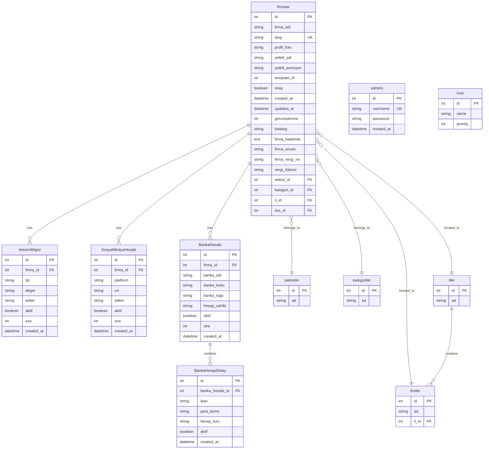

# 🗃️ Database Schema Genel Bakış

## Sistem Mimarisi

Dijital Kartvizit sistemi, PostgreSQL veritabanı ve Prisma ORM kullanarak tasarlanmış modüler bir veritabanı yapısına sahiptir.

## 📊 Schema Diyagramı



## 🎯 Core Tables

### 1. firmalar (Ana Tablo)
Sistemin kalbi. Her dijital kartvizit bir firmayı temsil eder.

**Amaç**: İşletme bilgileri ve kartvizit meta verilerini saklar
**İlişkiler**: 1:N → Tüm detay tabloları ile bağlantılı

### 2. IletisimBilgisi
Firma iletişim bilgilerini esnek yapıda saklar.

**Amaç**: Telefon, email, adres gibi çoklu iletişim bilgileri
**Tip Değerleri**: `telefon`, `email`, `adres`, `website`, `fax`

### 3. SosyalMedyaHesabi
Sosyal medya platform bağlantılarını yönetir.

**Amaç**: Instagram, LinkedIn, Twitter vb. platform linkleri
**Platform Değerleri**: `instagram`, `linkedin`, `twitter`, `facebook`, `youtube`, `tiktok`

### 4. BankaHesabi + BankaHesapDetay
İki seviyeli banka hesabı yapısı.

**Amaç**: Birden fazla banka, her bankada birden fazla hesap

## 📈 Tablo İstatistikleri

| Tablo | Tahmini Boyut | Günlük Büyüme | Kritik Seviye |
|-------|---------------|---------------|---------------|
| **firmalar** | ~1K kayıt | +10-50 | Ana tablo |
| **IletisimBilgisi** | ~5K kayıt | +50-250 | Yüksek |
| **SosyalMedyaHesabi** | ~3K kayıt | +30-150 | Orta |
| **BankaHesabi** | ~500 kayıt | +5-25 | Düşük |
| **BankaHesapDetay** | ~800 kayıt | +8-40 | Düşük |

## 🔍 Index Stratejisi

### Primary Indexes
- Tüm tablolarda `id` primary key (auto-increment)
- `firmalar.slug` unique index (URL slug için)
- `admins.username` unique index

### Performance Indexes
```sql
-- İletişim bilgileri hızlı erişimi
CREATE INDEX idx_iletisim_firma_tip ON IletisimBilgisi(firma_id, tip);

-- Sosyal medya platform araması
CREATE INDEX idx_sosyal_medya_platform ON SosyalMedyaHesabi(firma_id, platform);

-- IBAN araması (banka işlemleri için)
CREATE INDEX idx_banka_detay_iban ON BankaHesapDetay(iban);

-- Coğrafi arama (il-ilçe)
CREATE INDEX idx_ilceler_il ON ilceler(il_id);
```

### Search Indexes
```sql
-- Firma arama (metin araması için)
CREATE INDEX idx_firma_search ON firmalar(firma_adi, slug);

-- İçerik araması
CREATE INDEX idx_firma_content ON firmalar(firma_hakkinda);
```

## 🚀 Performans Optimizasyonları

### 1. Connection Pooling
```typescript
// lib/db.ts - Connection pool konfigürasyonu
const pool = new Pool({
  max: 20,         // maksimum bağlantı
  min: 2,          // minimum bağlantı
  idle: 10000,     // 10 saniye idle timeout
  acquire: 30000,  // 30 saniye acquire timeout
});
```

### 2. Query Optimizations
- Foreign key'ler için JOIN yerine denormalized data
- Sık kullanılan alanlar için computed columns
- Pagination için OFFSET yerine cursor-based approach

### 3. Caching Strategy
```typescript
// Redis cache keys
const CACHE_KEYS = {
  FIRMA_DETAIL: 'firma:detail:{slug}',
  FIRMA_LIST: 'firma:list:{page}:{limit}',
  SECTORS: 'lookup:sectors',
  CITIES: 'lookup:cities'
};

// Cache TTL (Time To Live)
const CACHE_TTL = {
  FIRMA_DETAIL: 3600,    // 1 saat
  FIRMA_LIST: 1800,      // 30 dakika
  LOOKUPS: 86400         // 24 saat
};
```

## 🔐 Güvenlik Measures

### 1. Row Level Security (RLS)
```sql
-- Supabase RLS Policy örneği
CREATE POLICY "Firmalar sadece admin tarafından düzenlenebilir"
ON firmalar FOR ALL
TO authenticated
USING (auth.role() = 'admin');

CREATE POLICY "Firmalar herkese açık okunabilir"
ON firmalar FOR SELECT
TO anon
USING (onay = true AND aktif = true);
```

### 2. Data Encryption
- Şifreler bcrypt ile hash'lenir
- Hassas alanlar (IBAN) uygulama seviyesinde şifrelenir
- SSL/TLS bağlantı zorunlu

### 3. Input Validation
```typescript
// Prisma validation örneği
const FirmaSchema = z.object({
  firma_adi: z.string().min(2).max(255),
  slug: z.string().regex(/^[a-z0-9-]+$/),
  yetkili_adi: z.string().min(2).max(100),
  template_id: z.number().min(1).max(50)
});
```

## 📊 Backup Strategy

### 1. Automated Backups
- **Frequency**: Her gece 02:00 (UTC+3)
- **Retention**: 30 gün günlük, 12 hafta haftalık
- **Location**: Supabase otomatik backup + AWS S3

### 2. Point-in-Time Recovery
- **RPO**: 1 dakika (Recovery Point Objective)
- **RTO**: 15 dakika (Recovery Time Objective)
- **Method**: Supabase PITR + WAL-E

### 3. Disaster Recovery
```bash
# Backup komutu
pg_dump $DATABASE_URL > backup_$(date +%Y%m%d_%H%M%S).sql

# Restore komutu
psql $DATABASE_URL < backup_file.sql
```

## 🔄 Migration Strategy

### 1. Schema Evolution
```prisma
// Yeni migration örneği
generator client {
  provider = "prisma-client-js"
}

model firmalar {
  // ... existing fields
  
  // Yeni alanlar (nullable olarak başla)
  yeni_alan    String?
  created_by   Int?    @default(1)
  
  // İndeksler
  @@index([created_by])
}
```

### 2. Deployment Migrations
```bash
# Development
npx prisma db push

# Production
npx prisma migrate deploy

# Rollback (gerekirse)
npx prisma migrate reset
```

## 🚨 Monitoring & Alerts

### 1. Performance Monitoring
- Slow query detection (>1s)
- Connection pool monitoring
- Cache hit rate tracking

### 2. Business Logic Monitoring
- Günlük firma oluşturma sayısı
- Template usage statistics
- Error rate tracking

### 3. Health Checks
```typescript
// API endpoint: /api/health/database
export async function GET() {
  try {
    const result = await prisma.$queryRaw`SELECT 1 as health`;
    return NextResponse.json({ 
      status: 'healthy', 
      timestamp: new Date(),
      connections: await prisma.$queryRaw`SELECT count(*) FROM pg_stat_activity`
    });
  } catch (error) {
    return NextResponse.json({ 
      status: 'unhealthy', 
      error: error.message 
    }, { status: 503 });
  }
}
```

## 📚 İlgili Dökümanlar

- [Tablo Detayları](./tables.md) - Her tablonun detaylı açıklaması
- [Migration Guide](../migrations/README.md) - Migration prosedürleri
- [Performance Tuning](../../10-performance/database-optimization.md) - Performans optimizasyonu
- [Backup Procedures](../backup/README.md) - Yedekleme prosedürleri
- [Security Guidelines](../../08-security/database-security.md) - Güvenlik kuralları

---

*Son güncelleme: 2025-08-25 | Schema Version: 1.2.0*