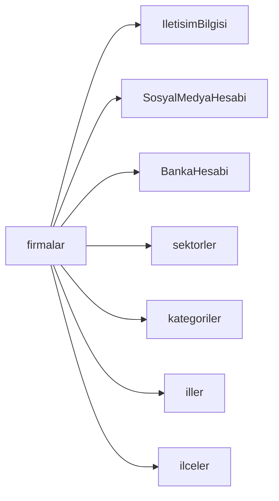

# 📋 Database Tables Detaylı Dokümantasyon

## 🏢 firmalar (Ana İşletme Tablosu)

### Amaç
Sistemin kalbi olan ana tablo. Her dijital kartvizit bir firmayı temsil eder ve tüm detay bilgileri bu tabloya bağlıdır.

### Tablo Yapısı

| Kolon | Tip | Null | Default | Açıklama |
|-------|-----|------|---------|----------|
| **id** | `INTEGER` | NO | AUTO_INCREMENT | Primary Key |
| **firma_adi** | `VARCHAR(255)` | NO | - | İşletme adı |
| **slug** | `VARCHAR(255)` | NO | UNIQUE | URL-friendly identifier |
| **profil_foto** | `VARCHAR(500)` | YES | NULL | Yetkili kişi profil fotoğrafı |
| **vcard_dosya** | `VARCHAR(500)` | YES | NULL | vCard dosya yolu |
| **yetkili_adi** | `VARCHAR(100)` | YES | NULL | Yetkili kişi adı |
| **yetkili_pozisyon** | `VARCHAR(100)` | YES | NULL | Yetkili kişi pozisyonu |
| **created_at** | `TIMESTAMP` | NO | now() | Kayıt oluşturma zamanı |
| **updated_at** | `TIMESTAMP` | NO | now() | Son güncelleme zamanı |
| **goruntulenme** | `INTEGER` | NO | 0 | Görüntülenme sayısı |
| **katalog** | `VARCHAR(500)` | YES | NULL | Katalog dosya yolu |
| **firma_hakkinda** | `TEXT` | YES | NULL | Firma hakkında açıklama |
| **firma_hakkinda_baslik** | `VARCHAR(100)` | YES | "Hakkımızda" | Hakkımızda bölüm başlığı |
| **firma_unvan** | `VARCHAR(255)` | YES | NULL | Resmi firma unvanı |
| **firma_vergi_no** | `VARCHAR(20)` | YES | NULL | Vergi numarası |
| **vergi_dairesi** | `VARCHAR(100)` | YES | NULL | Bağlı vergi dairesi |
| **sektor_id** | `INTEGER` | YES | NULL | Foreign Key → sektorler |
| **kategori_id** | `INTEGER` | YES | NULL | Foreign Key → kategoriler |
| **il_id** | `INTEGER` | YES | NULL | Foreign Key → iller |
| **ilce_id** | `INTEGER` | YES | NULL | Foreign Key → ilceler |
| **onay** | `BOOLEAN` | NO | false | Admin onay durumu |
| **tip** | `VARCHAR(50)` | YES | NULL | Firma tipi (şirket, şahıs) |
| **firma_logo** | `VARCHAR(500)` | YES | NULL | Firma logo dosya yolu |
| **template_id** | `INTEGER` | NO | 1 | Kullanılan template ID |

### İndeksler

```sql
-- Primary Key
PRIMARY KEY (id)

-- Unique Constraints
UNIQUE KEY uk_firmalar_slug (slug)

-- Foreign Key Indexes
KEY idx_firmalar_sektor (sektor_id)
KEY idx_firmalar_kategori (kategori_id) 
KEY idx_firmalar_il (il_id)
KEY idx_firmalar_ilce (ilce_id)

-- Performance Indexes
KEY idx_firmalar_onay_aktif (onay, tip)
KEY idx_firmalar_template (template_id)
KEY idx_firmalar_created (created_at)
KEY idx_firmalar_goruntulenme (goruntulenme DESC)

-- Search Indexes
KEY idx_firmalar_search (firma_adi, slug)
FULLTEXT KEY ft_firmalar_content (firma_adi, firma_hakkinda)
```

### Validation Rules

```typescript
const FirmaValidation = {
  firma_adi: {
    required: true,
    minLength: 2,
    maxLength: 255,
    pattern: /^[a-zA-ZğüşıöçĞÜŞİÖÇ0-9\s\.-]+$/
  },
  slug: {
    required: true,
    unique: true,
    pattern: /^[a-z0-9-]+$/,
    maxLength: 255
  },
  yetkili_adi: {
    maxLength: 100,
    pattern: /^[a-zA-ZğüşıöçĞÜŞİÖÇ\s]+$/
  },
  template_id: {
    required: true,
    min: 1,
    max: 50
  },
  firma_vergi_no: {
    pattern: /^\d{10}$/ // 10 haneli vergi no
  }
}
```

### İlişkiler



---

## 📞 IletisimBilgisi (İletişim Bilgileri)

### Amaç
Firma iletişim bilgilerini esnek yapıda saklar. Bir firma birden fazla telefon, email ve adres bilgisine sahip olabilir.

### Tablo Yapısı

| Kolon | Tip | Null | Default | Açıklama |
|-------|-----|------|---------|----------|
| **id** | `INTEGER` | NO | AUTO_INCREMENT | Primary Key |
| **firma_id** | `INTEGER` | NO | - | Foreign Key → firmalar |
| **tip** | `VARCHAR(50)` | NO | - | İletişim tipi |
| **deger** | `VARCHAR(500)` | NO | - | İletişim değeri |
| **etiket** | `VARCHAR(100)` | YES | NULL | Görünen etiket |
| **aktif** | `BOOLEAN` | NO | true | Aktif durum |
| **sira** | `INTEGER` | NO | 0 | Sıralama |
| **created_at** | `TIMESTAMP` | NO | now() | Kayıt zamanı |

### İletişim Tipleri

```typescript
enum IletisimTipi {
  TELEFON = 'telefon',
  EMAIL = 'email', 
  ADRES = 'adres',
  WEBSITE = 'website',
  FAX = 'fax',
  WHATSAPP = 'whatsapp'
}
```

### Örnek Kayıtlar

```sql
-- Telefon bilgisi
INSERT INTO IletisimBilgisi (firma_id, tip, deger, etiket, sira) 
VALUES (1, 'telefon', '+905551234567', 'İş Telefonu', 1);

-- Email bilgisi
INSERT INTO IletisimBilgisi (firma_id, tip, deger, etiket, sira)
VALUES (1, 'email', 'info@abcteknoloji.com', 'Genel Email', 1);

-- Adres bilgisi
INSERT INTO IletisimBilgisi (firma_id, tip, deger, etiket, sira)
VALUES (1, 'adres', 'Maslak Mahallesi, Sarıyer/İstanbul', 'Merkez Ofis', 1);
```

---

## 📱 SosyalMedyaHesabi (Sosyal Medya)

### Amaç
Firma sosyal medya hesaplarını yönetir. Platform bazlı URL'leri ve görünüm sırasını saklar.

### Tablo Yapısı

| Kolon | Tip | Null | Default | Açıklama |
|-------|-----|------|---------|----------|
| **id** | `INTEGER` | NO | AUTO_INCREMENT | Primary Key |
| **firma_id** | `INTEGER` | NO | - | Foreign Key → firmalar |
| **platform** | `VARCHAR(50)` | NO | - | Sosyal medya platformu |
| **url** | `VARCHAR(500)` | NO | - | Profil URL'i |
| **etiket** | `VARCHAR(100)` | YES | NULL | Görünen etiket |
| **aktif** | `BOOLEAN` | NO | true | Aktif durum |
| **sira** | `INTEGER` | NO | 0 | Sıralama |
| **created_at** | `TIMESTAMP` | NO | now() | Kayıt zamanı |

### Desteklenen Platformlar

```typescript
enum SosyalMedyaPlatform {
  INSTAGRAM = 'instagram',
  LINKEDIN = 'linkedin',
  TWITTER = 'twitter', 
  FACEBOOK = 'facebook',
  YOUTUBE = 'youtube',
  TIKTOK = 'tiktok',
  TELEGRAM = 'telegram',
  DISCORD = 'discord'
}
```

### URL Validation

```typescript
const SosyalMedyaValidation = {
  instagram: /^https:\/\/(www\.)?instagram\.com\/[a-zA-Z0-9_.]+\/?$/,
  linkedin: /^https:\/\/(www\.)?linkedin\.com\/(in|company)\/[a-zA-Z0-9-]+\/?$/,
  twitter: /^https:\/\/(www\.)?twitter\.com\/[a-zA-Z0-9_]+\/?$/,
  facebook: /^https:\/\/(www\.)?facebook\.com\/[a-zA-Z0-9.]+\/?$/,
  youtube: /^https:\/\/(www\.)?youtube\.com\/(c|channel|user)\/[a-zA-Z0-9_-]+\/?$/
}
```

---

## 🏦 BankaHesabi (Banka Bilgileri)

### Amaç
Firma banka bilgilerini iki seviyede yönetir. Ana banka bilgileri ve detay hesap bilgileri.

### Tablo Yapısı

| Kolon | Tip | Null | Default | Açıklama |
|-------|-----|------|---------|----------|
| **id** | `INTEGER` | NO | AUTO_INCREMENT | Primary Key |
| **firma_id** | `INTEGER` | NO | - | Foreign Key → firmalar |
| **banka_adi** | `VARCHAR(100)` | NO | - | Banka adı |
| **banka_kodu** | `VARCHAR(10)` | YES | NULL | Banka swift/kodu |
| **banka_logo** | `VARCHAR(500)` | YES | NULL | Banka logo URL |
| **hesap_sahibi** | `VARCHAR(255)` | NO | - | Hesap sahibi adı |
| **aktif** | `BOOLEAN` | NO | true | Aktif durum |
| **sira** | `INTEGER` | NO | 0 | Sıralama |
| **created_at** | `TIMESTAMP` | NO | now() | Kayıt zamanı |

---

## 💳 BankaHesapDetay (Hesap Detayları)

### Amaç
Her banka için birden fazla hesap (IBAN) bilgisi saklar.

### Tablo Yapısı

| Kolon | Tip | Null | Default | Açıklama |
|-------|-----|------|---------|----------|
| **id** | `INTEGER` | NO | AUTO_INCREMENT | Primary Key |
| **banka_hesabi_id** | `INTEGER` | NO | - | Foreign Key → BankaHesabi |
| **iban** | `VARCHAR(35)` | NO | - | IBAN numarası |
| **para_birimi** | `VARCHAR(3)` | NO | 'TRY' | Para birimi kodu |
| **hesap_turu** | `VARCHAR(50)` | YES | NULL | Hesap türü |
| **aktif** | `BOOLEAN` | NO | true | Aktif durum |
| **created_at** | `TIMESTAMP` | NO | now() | Kayıt zamanı |

### IBAN Validation

```typescript
const IBANValidation = {
  turkey: /^TR\d{2}\s?\d{4}\s?\d{4}\s?\d{4}\s?\d{4}\s?\d{4}\s?\d{2}$/,
  format: (iban: string) => iban.replace(/\s/g, '').toUpperCase(),
  checksum: (iban: string) => {
    // IBAN checksum algoritması
    const rearranged = iban.slice(4) + iban.slice(0, 4);
    // ... checksum hesaplama
  }
}
```

---

## 👤 admins (Yönetici)

### Amaç
Sistem yöneticilerinin kimlik bilgilerini saklar.

### Tablo Yapısı

| Kolon | Tip | Null | Default | Açıklama |
|-------|-----|------|---------|----------|
| **id** | `INTEGER` | NO | AUTO_INCREMENT | Primary Key |
| **username** | `VARCHAR(100)` | NO | UNIQUE | Kullanıcı adı |
| **password** | `VARCHAR(255)` | NO | - | Hashlenmiş şifre |
| **created_at** | `TIMESTAMP` | NO | now() | Kayıt zamanı |

### Security Implementation

```typescript
import bcrypt from 'bcrypt';

// Şifre hashleme
const hashPassword = async (password: string) => {
  const saltRounds = 12;
  return await bcrypt.hash(password, saltRounds);
};

// Şifre doğrulama
const verifyPassword = async (password: string, hash: string) => {
  return await bcrypt.compare(password, hash);
};
```

---

## 🏭 sektorler (Sektör Tablosu)

### Amaç
İşletmelerin faaliyet gösterdiği sektörleri kategorize eder.

### Tablo Yapısı

| Kolon | Tip | Null | Default | Açıklama |
|-------|-----|------|---------|----------|
| **id** | `INTEGER` | NO | AUTO_INCREMENT | Primary Key |
| **ad** | `VARCHAR(100)` | NO | - | Sektör adı |

### Örnek Veriler

```sql
INSERT INTO sektorler (ad) VALUES 
('Teknoloji'),
('İnşaat'),
('Sağlık'),
('Eğitim'),
('Finans'),
('Turizm'),
('Gıda'),
('Tekstil'),
('Otomotiv'),
('Enerji');
```

---

## 📂 kategoriler (Kategori Tablosu)

### Amaç
Firmaları alt kategorilerde gruplandırır.

### Tablo Yapısı

| Kolon | Tip | Null | Default | Açıklama |
|-------|-----|------|---------|----------|
| **id** | `INTEGER` | NO | AUTO_INCREMENT | Primary Key |
| **ad** | `VARCHAR(100)` | NO | - | Kategori adı |

---

## 🌍 iller (İller Tablosu)

### Amaç
Türkiye'deki 81 ili saklar.

### Tablo Yapısı

| Kolon | Tip | Null | Default | Açıklama |
|-------|-----|------|---------|----------|
| **id** | `INTEGER` | NO | AUTO_INCREMENT | Primary Key |
| **ad** | `VARCHAR(50)` | NO | - | İl adı |

---

## 🏘️ ilceler (İlçeler Tablosu)

### Amaç
İllere bağlı ilçeleri saklar.

### Tablo Yapısı

| Kolon | Tip | Null | Default | Açıklama |
|-------|-----|------|---------|----------|
| **id** | `INTEGER` | NO | AUTO_INCREMENT | Primary Key |
| **ad** | `VARCHAR(100)` | NO | - | İlçe adı |
| **il_id** | `INTEGER` | NO | - | Foreign Key → iller |

---

## 🎨 Icon (Icon Yönetimi)

### Amaç
Sistemde kullanılan ikonların öncelik sırasını yönetir.

### Tablo Yapısı

| Kolon | Tip | Null | Default | Açıklama |
|-------|-----|------|---------|----------|
| **id** | `INTEGER` | NO | AUTO_INCREMENT | Primary Key |
| **name** | `VARCHAR(100)` | NO | - | Icon adı |
| **priority** | `INTEGER` | NO | - | Öncelik sırası |

---

## 🔄 Tablo İlişkileri Özeti

### One-to-Many İlişkiler

```typescript
// Firma → İletişim Bilgileri (1:N)
firmalar.id → IletisimBilgisi.firma_id

// Firma → Sosyal Medya (1:N)
firmalar.id → SosyalMedyaHesabi.firma_id

// Firma → Banka Hesapları (1:N)
firmalar.id → BankaHesabi.firma_id

// Banka → Hesap Detayları (1:N)
BankaHesabi.id → BankaHesapDetay.banka_hesabi_id

// İl → İlçeler (1:N)
iller.id → ilceler.il_id
```

### Many-to-One İlişkiler

```typescript
// Firma → Sektör (N:1)
firmalar.sektor_id → sektorler.id

// Firma → Kategori (N:1)
firmalar.kategori_id → kategoriler.id

// Firma → İl (N:1)
firmalar.il_id → iller.id

// Firma → İlçe (N:1)
firmalar.ilce_id → ilceler.id
```

---

## 📊 Performans Notları

### Query Optimizasyonu

```sql
-- Firma detay sayfası için optimize edilmiş sorgu
SELECT 
  f.*,
  s.ad as sektor_adi,
  k.ad as kategori_adi,
  il.ad as il_adi,
  ilc.ad as ilce_adi
FROM firmalar f
LEFT JOIN sektorler s ON f.sektor_id = s.id
LEFT JOIN kategoriler k ON f.kategori_id = k.id  
LEFT JOIN iller il ON f.il_id = il.id
LEFT JOIN ilceler ilc ON f.ilce_id = ilc.id
WHERE f.slug = ? AND f.onay = true;

-- İletişim bilgileri ayrı sorgu (N+1 problem önleme)
SELECT * FROM IletisimBilgisi 
WHERE firma_id = ? AND aktif = true 
ORDER BY sira ASC, id ASC;
```

### Cache Strategy

```typescript
// Redis cache anahtarları
const CACHE_KEYS = {
  FIRMA_DETAIL: (slug: string) => `firma:${slug}:v2`,
  FIRMA_CONTACTS: (id: number) => `contacts:${id}:v1`,
  SECTORS: 'sectors:list:v1',
  CITIES: 'cities:list:v1'
};

// Cache TTL (saniye)
const CACHE_TTL = {
  FIRMA_DETAIL: 3600,      // 1 saat
  FIRMA_CONTACTS: 1800,    // 30 dakika
  LOOKUPS: 86400           // 24 saat
};
```

---

*Son güncelleme: 2025-08-25 | Schema Version: 1.2.0*