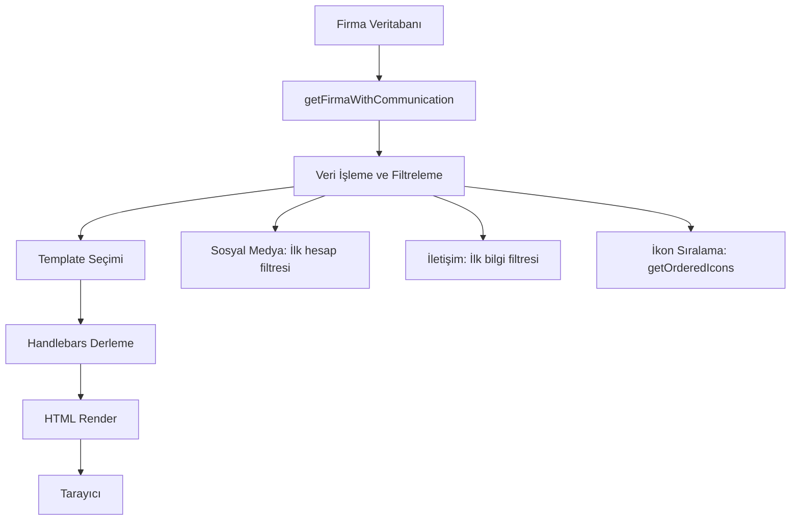

# 📚 Dijital Kartvizit Template Sistemi Dokümantasyonu

## İçindekiler
- [🎯 Genel Bakış](#-genel-bakış)
- [🏗️ Template Sistemi Mimarisi](#️-template-sistemi-mimarisi)
- [📁 Dosya Yapısı](#-dosya-yapısı)
- [⚙️ Template Çalışma Mantığı](#️-template-çalışma-mantığı)
- [🎨 Mevcut Template Analizi](#-mevcut-template-analizi)
- [➕ Yeni Template Ekleme Rehberi](#-yeni-template-ekleme-rehberi)
- [🔧 Admin Panel Entegrasyonu](#-admin-panel-entegrasyonu)
- [📊 Veri Akışı](#-veri-akışı)
- [⚠️ Önemli Notlar ve İpuçları](#️-önemli-notlar-ve-ipuçları)
- [🐛 Sorun Giderme](#-sorun-giderme)

---

## 🎯 Genel Bakış

Dijital Kartvizit sisteminde template'ler, firma bilgilerinin görsel olarak sunulduğu HTML şablonlarıdır. Sistem **Handlebars** template engine kullanarak dinamik veri yerleştirmesi yapar.

### Temel Özellikler
- **Handlebars Template Engine**: Dinamik veri yerleştirme
- **Responsive Tasarım**: Mobil uyumlu (360px, 480px breakpoint'ler)
- **Modüler Yapı**: Her template bağımsız bir TypeScript modülü
- **Dinamik İkon Sıralaması**: Admin panel üzerinden özelleştirilebilir
- **Çoklu Template Desteği**: Birden fazla tema arasında seçim

---

## 🏗️ Template Sistemi Mimarisi

```
app/
├── lib/
│   ├── templates/
│   │   ├── template1-gold.ts         # Gold tema (Ana template)
│   │   ├── template3-golden-edge.ts  # Golden Edge tema
│   │   ├── template-base.ts          # Temel template yapısı
│   │   ├── qr-templates.ts           # QR kod template'leri
│   │   └── templateRegistry.ts       # Template kayıt sistemi
│   │
│   ├── cardTemplate.ts               # Template seçim ve yönetim
│   ├── iconOrder.ts                  # İkon sıralama mantığı
│   └── direct-db.ts                  # Veritabanı işlemleri
│
├── [slug]/
│   └── page.tsx                      # Template render eden ana sayfa
│
├── admin/
│   ├── firma-ekle/
│   │   └── page.tsx                  # Yeni firma ekleme (template seçimi)
│   └── temalar/
│       └── page.tsx                  # Template yönetim paneli
```

---

## 📁 Dosya Yapısı

### 1. Template Dosyası (`template1-gold.ts`)
```typescript
export const goldTemplate = `<!DOCTYPE html>
<html lang="tr">
<head>
    <!-- Meta tags, CSS -->
    <style>
        /* Template-specific CSS */
    </style>
</head>
<body>
    <!-- Handlebars template syntax -->
    {{#if yetkili_adi}}
        <h1>{{yetkili_adi}}</h1>
    {{/if}}
    
    {{#each social_media}}
        <!-- Dynamic content -->
    {{/each}}
</body>
</html>`;
```

### 2. Template Registry (`templateRegistry.ts`)
```typescript
export interface TemplateInfo {
    id: number;
    name: string;
    description: string;
    preview?: string;
    isActive: boolean;
}

export const templates: TemplateInfo[] = [
    {
        id: 1,
        name: 'Gold Template',
        description: 'Profesyonel altın temalı tasarım',
        preview: '/preview/gold.png',
        isActive: true
    },
    // Diğer template'ler...
];
```

---

## ⚙️ Template Çalışma Mantığı

### 1. Veri Hazırlama (`[slug]/page.tsx`)

```typescript
// Firma verilerini al
const firma = await getFirmaWithCommunication(slug);

// Sosyal medya verilerini düzenle - HER PLATFORMDAN SADECE İLK HESAP
const processedPlatforms = new Set<string>();
firma.sosyal_medya_hesaplari.forEach((item) => {
    if (!processedPlatforms.has(item.platform)) {
        processedPlatforms.add(item.platform);
        socialMediaArray.push({
            icon: meta.icon,
            label: item.etiket,
            url: item.url,
            platform: item.platform
        });
    }
});

// İkon sıralamasını al
const icon_order = getOrderedIcons({
    social_media: socialMediaArray,
    communication: communicationArray,
    // ...
});
```

### 2. Template Derleme

```typescript
// Template seçimi
const selectedTemplate = getTemplateByType(data.template_id || 1);

// Handlebars ile derleme
const compiledTemplate = handlebars.compile(selectedTemplate);

// Veri ile doldurma
const html = compiledTemplate(data);
```

### 3. Handlebars Helper'ları

```typescript
// Özel karşılaştırma helper'ı
handlebars.registerHelper('ifEquals', function(arg1, arg2, options) {
    return (arg1 == arg2) ? options.fn(this) : options.inverse(this);
});
```

---

## 🎨 Mevcut Template Analizi

### Gold Template (template1-gold.ts)

#### CSS Özellikleri
```css
/* Ana container - Önemli: overflow ve max-width kullanımına dikkat! */
.main-container {
    background: url('...') no-repeat center center;
    background-size: contain;  /* Arka planın genişlememesi için */
    width: 100%;
    min-height: 100vh;
    /* max-width: 100vw; KULLANMAYIN - genişlemeye neden olur */
    /* overflow-x: hidden; KULLANMAYIN - genişlemeye neden olur */
}

/* İkon ızgara - Responsive değerlere dikkat */
.icons-grid {
    display: grid;
    grid-template-columns: repeat(4, 1fr);
    gap: 8px;  /* Masaüstü */
    max-width: 320px;
}

@media (max-width: 480px) {
    .icons-grid {
        gap: 6px;  /* Mobil - ÖNEMLI: 20px yapmayın! */
        max-width: 300px;  /* ÖNEMLI: 340px yapmayın! */
    }
}

@media (max-width: 360px) {
    .icons-grid {
        gap: 6px;
        max-width: 280px;  /* En küçük ekran */
    }
}
```

#### İkon Renkleri
```css
.icon-telefon i { color: #4CAF50 !important; }
.icon-whatsapp i { color: #25D366 !important; }
.icon-instagram i { color: #E4405F !important; }
.icon-email i { color: #FF9800 !important; }
/* ... diğer ikonlar */
```

#### Dinamik İkon Render Mantığı
```handlebars
{{#each icon_order}}
    {{#ifEquals this.id 'instagram'}}
        {{#each ../social_media}}
            {{#ifEquals this.platform 'instagram'}}
                <div class="icon-item">
                    <a href="{{this.url}}">
                        <i class="fab fa-instagram"></i>
                    </a>
                    <span class="icon-label">{{this.label}}</span>
                </div>
            {{/ifEquals}}
        {{/each}}
    {{/ifEquals}}
{{/each}}
```

---

## ➕ Yeni Template Ekleme Rehberi

### Adım 1: Template Dosyası Oluşturma

1. `app/lib/templates/` klasöründe yeni dosya oluşturun:
```bash
touch app/lib/templates/template2-modern.ts
```

2. Template yapısını oluşturun:
```typescript
export const modernTemplate = `<!DOCTYPE html>
<html lang="tr">
<head>
    <meta charset="UTF-8">
    <meta name="viewport" content="width=device-width, initial-scale=1.0">
    <title>{{firma_adi}} - Dijital Kartvizit</title>
    <link rel="stylesheet" href="https://cdnjs.cloudflare.com/ajax/libs/font-awesome/6.0.0-beta3/css/all.min.css">
    <style>
        /* Özel CSS stilleriniz */
        :root {
            --primary-color: #3B82F6;
            --secondary-color: #10B981;
            /* ... */
        }
        
        /* Responsive tasarım - ZORUNLU */
        @media (max-width: 480px) {
            /* Mobil stiller */
        }
        
        @media (max-width: 360px) {
            /* Küçük ekran stiller */
        }
    </style>
</head>
<body>
    <div class="main-container">
        <!-- Profil Bölümü -->
        {{#if yetkili_adi}}
            <h1>{{yetkili_adi}}</h1>
        {{/if}}
        
        <!-- İkon Grid - icon_order kullanımı ZORUNLU -->
        <div class="icons-grid">
            {{#each icon_order}}
                <!-- İkon render mantığı -->
            {{/each}}
        </div>
        
        <!-- JavaScript - Modal ve paylaşım fonksiyonları -->
        <script>
            // Gerekli JS fonksiyonları
        </script>
    </div>
</body>
</html>`;
```

### Adım 2: Template Registry'e Ekleme

`app/lib/templates/templateRegistry.ts` dosyasını güncelleyin:
```typescript
export const templates: TemplateInfo[] = [
    {
        id: 1,
        name: 'Gold Template',
        description: 'Profesyonel altın temalı tasarım',
        preview: '/preview/gold.png',
        isActive: true
    },
    {
        id: 2,  // Yeni ID
        name: 'Modern Template',
        description: 'Modern ve minimalist tasarım',
        preview: '/preview/modern.png',
        isActive: true
    }
];
```

### Adım 3: cardTemplate.ts Güncelleme

`app/lib/cardTemplate.ts` dosyasını güncelleyin:
```typescript
import { goldTemplate } from './templates/template1-gold';
import { modernTemplate } from './templates/template2-modern';  // Yeni import

export function getTemplateByType(templateId?: number): string {
    switch (templateId) {
        case 1:
            return goldTemplate;
        case 2:
            return modernTemplate;  // Yeni case
        default:
            return goldTemplate;
    }
}
```

### Adım 4: Admin Panel'de Görüntüleme

Admin panel template listesine otomatik olarak eklenecektir. Preview resmi için:
```bash
# public/preview/ klasörüne template önizleme resmini ekleyin
cp template-preview.png public/preview/modern.png
```

---

## 🔧 Admin Panel Entegrasyonu

### 1. Firma Ekleme Sayfası (`app/admin/firma-ekle/page.tsx`)

Template seçimi dropdown'ı:
```tsx
<select 
    name="template_id" 
    className="w-full px-3 py-2 border rounded-lg"
    defaultValue="1"
>
    {templates.filter(t => t.isActive).map(template => (
        <option key={template.id} value={template.id}>
            {template.name} - {template.description}
        </option>
    ))}
</select>
```

### 2. Temalar Yönetim Sayfası (`app/admin/temalar/page.tsx`)

Template listesi ve önizleme:
```tsx
{templates.map(template => (
    <div key={template.id} className="template-card">
        
        <h3>{template.name}</h3>
        <p>{template.description}</p>
        <button onClick={() => toggleTemplate(template.id)}>
            {template.isActive ? 'Aktif' : 'Pasif'}
        </button>
    </div>
))}
```

---

## 📊 Veri Akışı



---

## ⚠️ Önemli Notlar ve İpuçları

### 1. İkon Sayısı Kontrolü
```javascript
// PROBLEM: Aynı platformdan birden fazla hesap gösterme
// ÇÖZÜM: Backend'de filtreleme yapın
const processedPlatforms = new Set();
firma.sosyal_medya_hesaplari.forEach(item => {
    if (!processedPlatforms.has(item.platform)) {
        // Sadece ilk hesabı al
    }
});
```

### 2. CSS Gap ve Max-width Değerleri
```css
/* YANLIŞ - Background genişlemesine neden olur */
.icons-grid {
    gap: 20px;       /* Çok geniş */
    max-width: 340px; /* Çok geniş */
}

/* DOĞRU */
.icons-grid {
    gap: 6px;        /* Sıkışık, düzenli */
    max-width: 300px; /* Optimal genişlik */
}
```

### 3. Handlebars Değişken Kullanımı
```handlebars
<!-- Basit değişken -->
{{firma_adi}}

<!-- Koşullu render -->
{{#if yetkili_adi}}
    <h1>{{yetkili_adi}}</h1>
{{/if}}

<!-- Döngü -->
{{#each social_media}}
    {{this.url}}  <!-- Döngü içi erişim -->
{{/each}}

<!-- Özel helper -->
{{#ifEquals this.id 'instagram'}}
    <!-- Instagram özel içerik -->
{{/ifEquals}}
```

### 4. Responsive Tasarım Zorunlulukları
- **360px**: En küçük ekran boyutu
- **480px**: Standart mobil
- **768px**: Tablet (opsiyonel)
- **1024px+**: Masaüstü

### 5. Font Awesome İkon Kullanımı
```html
<!-- Solid ikonlar -->
<i class="fas fa-phone"></i>

<!-- Brand ikonlar -->
<i class="fab fa-instagram"></i>

<!-- Regular ikonlar -->
<i class="far fa-envelope"></i>
```

---

## 🐛 Sorun Giderme

### Problem: Background genişliyor
**Çözüm**: 
- `max-width: 100vw` ve `overflow-x: hidden` kullanmayın
- İkon sayısını kontrol edin (max 16 olmalı)
- Gap değerlerini kontrol edin

### Problem: İkonlar çift görünüyor
**Çözüm**:
- Backend'de filtreleme yapın
- Her platformdan/tipten sadece ilk değeri alın

### Problem: Template görünmüyor
**Kontrol Edilecekler**:
1. Template ID'si doğru mu?
2. cardTemplate.ts'de import edildi mi?
3. Template registry'de kayıtlı mı?
4. Handlebars syntax hataları var mı?

### Problem: Responsive bozuk
**Çözüm**:
- Media query sıralaması doğru mu? (Büyükten küçüğe)
- Box-sizing: border-box kullanıldı mı?
- Viewport meta tag'i var mı?

---

## 📝 Template Checklist

Yeni template eklerken bu kontrol listesini kullanın:

- [ ] Template dosyası oluşturuldu (`app/lib/templates/`)
- [ ] Template registry'e eklendi
- [ ] cardTemplate.ts'de import edildi ve case eklendi
- [ ] Responsive tasarım (360px, 480px) eklendi
- [ ] Font Awesome CDN linki eklendi
- [ ] Handlebars değişkenleri doğru kullanıldı
- [ ] icon_order döngüsü implement edildi
- [ ] JavaScript fonksiyonları (modal, share) eklendi
- [ ] CSS renk değişkenleri tanımlandı
- [ ] Preview resmi eklendi (`public/preview/`)
- [ ] Admin panel'de test edildi
- [ ] Farklı cihazlarda test edildi

---

## 🚀 Gelecek Geliştirmeler

1. **Template Editör**: Admin panel'den template düzenleme
2. **CSS Variables**: Renkleri admin'den değiştirme
3. **Component System**: Modüler bileşenler
4. **Template Marketplace**: Kullanıcıların template paylaşması
5. **A/B Testing**: Template performans analizi
6. **Dark Mode**: Otomatik karanlık mod desteği
7. **Animation Library**: Hazır animasyonlar
8. **Icon Packs**: Farklı ikon setleri desteği

---

## 📞 Destek

Template sistemi ile ilgili sorularınız için:
- Dokümantasyon: `/docs/TEMPLATE-SYSTEM-GUIDE.md`
- Örnek Template: `template1-gold.ts`
- Test Sayfası: `/demo-full-icons.html`

---

*Son güncelleme: Ocak 2025*
*Versiyon: 1.0.0*